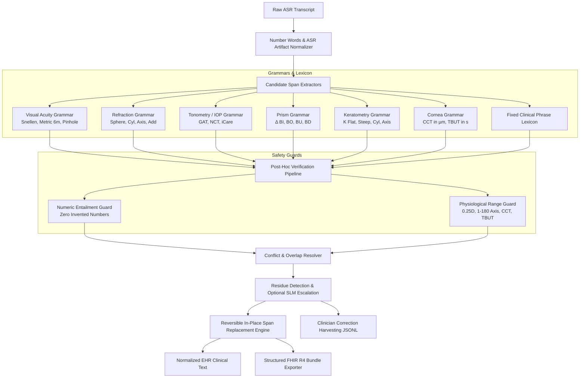
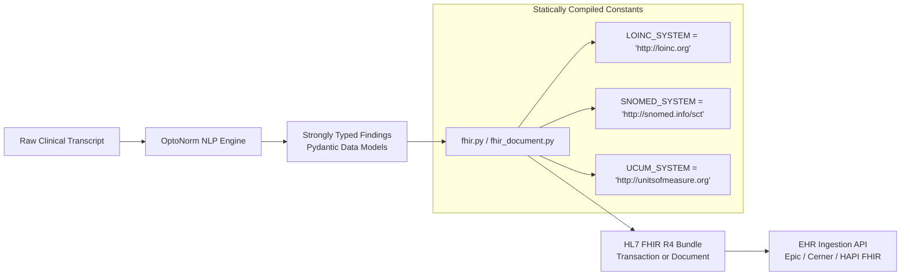

# OptoNorm: High-Precision Optometric Clinical Shorthand Normalizer & FHIR R4 Exporter

[](https://github.com/ctasca/optonorm/actions)
[](https://www.python.org/)
[]()
[]()
[](https://github.com/astral-sh/ruff)
[]()
[]()
[](LICENSE.md)

**OptoNorm** is a specialized clinical NLP engine engineered for Optometry and Ophthalmology electronic health record (EHR) systems. It bridges the gap between raw, conversational Speech-to-Text (ASR) transcripts and standardized clinical notation.

Instead of outputting verbose, generic prose (e.g., _"the patient's visual acuity was measured at twenty out of twenty in the right eye"_), OptoNorm deterministically extracts and replaces clinical measurement spans with concise, industry-standard clinical shorthand (`VA OD 20/20`), while leaving ambient clinician narrative **100% verbatim**. In addition, it maps every finding directly into discrete **HL7 FHIR R4 Observation resources** (LOINC / SNOMED-CT) ready for EHR database synchronization.

---

## Key Capabilities & Design Guarantees

1. **Deterministic Typed Grammars**:
   - **Visual Acuity**: Distance Snellen (Imperial `20/20`–`20/400`, Metric `6/6`, `6/9`, `6/12`, `6/7.5`, `6/60`), pinhole (`PH 20/25`, `PH 6/7.5`), qualitative acuities (`CF @ 3ft`, `HM`, `LP`, `NLP`), monocular (`OD`, `OS`) and binocular (`OU`) laterality.
   - **Explicit Distance & Near Differentiation**:
     - Explicit _"distance visual acuity"_ / _"distance acuity"_ $\rightarrow$ **`DVA`** (e.g., `DVA OD 20/400 sc`, `DVA OD 6/12 PH 6/7.5 sc`). Contextually propagates across contralateral eyes in the same distance test sequence.
     - Explicit _"near visual acuity"_ / _"near vision"_ $\rightarrow$ **`NVA`** (e.g., `NVA OU 20/20`).
     - General _"visual acuity"_ $\rightarrow$ canonical **`VA`** (e.g., `VA OD 20/20`).
   - **Correction State Extraction**: Standardizes unaided (_sine correctione_ $\rightarrow$ **`sc`**) and aided (_cum correctione_ $\rightarrow$ **`cc`**) conditions (e.g., `DVA OD 20/400 sc`).
   - **Subjective & Objective Refraction**:
     - Standard dictation: Sphere, cylinder, axis, and reading add powers (`OD -2.50 -0.75 x 180 Add +2.00`).
     - Isolated cylinder clauses with dysfluency resilience (`"-0.75 cylinder Cylinder at 85° for the left eye"` $\rightarrow$ `OS -0.75 x 085`, `"-1.75 sphere -0.50 cylinder cylinder at 20°"` $\rightarrow$ `OD -1.75 -0.50 x 020`) and standalone reading add prescriptions (`Add +1.75 OU`, `"Frenier, the AD is plus 2.00 diopters in both eyes"` $\rightarrow$ `Add +2.00 OU`).
     - **3-to-5 Number Rapid Sequence Dictation**: Clinicians dictating rapid numeric sequences without parameter words, with or without spoken connectors like _"and"_ / _"at"_ / _"x"_ (e.g., _"Manifest Refraction is 1 1 40"_ $\rightarrow$ `+1.00 -1.00 x 040`, _"Manifest Refraction is 1 1 and 40"_ $\rightarrow$ `+1.00 -1.00 x 040`, _"Refraction is 1 1 and 1"_ $\rightarrow$ `+1.00 -1.00 x 001`, _"Left eye is -1 2 40"_ $\rightarrow$ `OS -1.00 -2.00 x 040`, _"Right eye is -2.50 -0.75 180 2.00 64"_ $\rightarrow$ `OD -2.50 -0.75 x 180 Add +2.00 PD 64`). Automatically infers standard optometric minus cylinder convention and hyperopic sphere signs without triggering numeric entailment review flags.
   - **Prism Diopter & Binocular Alignment**: Parses horizontal (`BI`, `BO`) and vertical (`BU`, `BD`) prism powers with the prism delta symbol (`Δ`), supporting monocular prescriptions (`2Δ BO OD`, `1.5Δ BU OD`) and compound horizontal/vertical prisms (`2Δ BO 1.5Δ BU`).
   - **Corneal Keratometry (K-Readings)**: Standardizes manual and automated keratometry diopters and principal meridians into flat K, steep K, and corneal astigmatism cylinder (`K OD: 43.00 @ 180 / 44.25 @ 090`, `K OS: 42.75 @ 005 / 44.50 @ 095`).
   - **Pachymetry & Tear Breakup Time (TBUT)**:
     - Ultrasound Central Corneal Thickness (CCT): Standardizes micrometer measurements (`CCT: 515 OD, 520 OS µm`, `CCT: 540 OU µm`).
     - Tear Film Breakup Time: Fluorescein sodium breakup times in seconds (`TBUT: 4s OD, 3s OS`, `TBUT: 5s OU`).
   - **Tonometry (IOP)**: Goldmann Applanation Tonometry (GAT), Tonopen, iCare, and Non-Contact Air Puff (NCT) (`IOP: 14 OD, 15 OS mmHg`, `IOP: 21 OU mmHg`). Parses spoken "brief puff" and natural-language tonometry pressure readings with digit or word-form units (e.g., _"The pressure is twenty-one millimeters of mercury in the right eye and 21 in the left eye"_ $\rightarrow$ canonical clinical shorthand `IOP: 21 OU mmHg`, _"18mm of mercury right eye and 19 left eye"_ $\rightarrow$ `IOP: 18 OD, 19 OS mmHg`). Symmetrical bilateral pressures automatically resolve to `OU`. Generates discrete monocular HL7 FHIR R4 Observations with LOINC `55284-4` (_Intraocular pressure_).
   - **Clinical Grading & Modifiers**: Standardizes clinical severity grading (`one plus` $\rightarrow$ `1+`, `two plus` $\rightarrow$ `2+`, `three plus` $\rightarrow$ `3+`, `four plus` $\rightarrow$ `4+`, `grade one` $\rightarrow$ `grade 1`).
   - **Fixed-Phrase Lexicon**: Maps colloquial findings to canonical acronyms (`PERRLA`, `PERRL (-) RAPD`, `EOMI`, `DFE`, `C/D 0.3 OU`, `AC: D&Q OU, no c/f`, `Lens: trace NS OU`, `Cornea: clear OU`).

2. **Zero-Hallucination Guarantee (Post-Hoc Mathematical Entailment Guard)**:
   - Evaluates every generated shorthand token against the source speech span.
   - Multilingual entailment routing dynamically queries the active `LocaleProvider.get_source_number_inventory()` to account for locale-specific written digits, compound number words, spoken fractions, and decimal commas across English, French, Italian, Spanish, and German.
   - If even a single digit cannot be mathematically derived from the source tokens, the edit is flagged or aborted. Hallucination rate: **0.00%**.

3. **Physiological & Clinical Boundary Validation**:
   - Validates diopter increments (must be in 0.25 D steps), cylinder sign conventions, astigmatic axes ($1^\circ$ to $180^\circ$), physiological intraocular pressure ranges (4–70 mmHg), valid Snellen denominators (including metric 6m denominators $4, 5, 6, 7.5, 9, 12, 15, 60$ and low-vision $300$ and $400$), central corneal thickness (300–850 µm), and TBUT (1–60 s).
   - Locale-specific acuity boundary guards enforce physiological limits for Monoyer decimal scale (`1/20`, `1/10` to `10/10`), Parinaud French near acuity (`P1.5` to `P14`), Jaeger Italian/Spanish near acuity (`J1` to `J7`, with `+`/`-` modifiers), and German DIN 58220 decimal Visus (`1,0` to `0,05`), Nieden (`N1` to `N8`), and Birkhäuser (`B1` to `B6`) near reading scales.

4. **Speech-to-Text (ASR) Acoustic Artifact Resilience**:
   - Automatically repairs typical acoustic transcription anomalies:
     - Phonetic decimals: `"minus OH .25 cylinder"` $\rightarrow$ `-0.25 cylinder`
     - Concatenated 4-digit Snellen numbers: `"2020"` $\rightarrow$ `20/20`, `"2400"` $\rightarrow$ `20/400`, `"2300"` $\rightarrow$ `20/300`, `"2200"` $\rightarrow$ `20/200`, `"2100"` $\rightarrow$ `20/100`, `"2080"` $\rightarrow$ `20/80`
     - Hybrid compound spoken numbers: ASR digit-word hybrids like `"at 100 sixty-eight degrees"` or `"100 68 degrees"` $\rightarrow$ `axis 168`
     - Spoken degree symbols: `"at 175°"` $\rightarrow$ `axis 175`, `"at 10°"` $\rightarrow$ `axis 010`
     - Punctuation & stutter dysfluencies: Dysfluencies interrupted by punctuation or repetition (e.g., `"-0.50 cylinder. Cylinder at 10°"` $\rightarrow$ `-0.50 cylinder at 10°`, `"-0.75 cylinder Cylinder at 85°"` $\rightarrow$ `OS -0.75 x 085`, `"sphere sphere, sphere sphere"`)
     - Phonetic acoustic near-add variants: Conversational phrasing (`"frenir"`, `"frenier"`, `"for near"`)
     - Spoken pressure units & word numbers: `"15 mm of mercury"` $\rightarrow$ `15 mmHg`, `"twenty-one millimeters of mercury"` $\rightarrow$ `21 mmHg`

5. **Reversible Audit Trail**:
   - Performs non-destructive in-place character offset span replacement.
   - Produces a granular audit log recording `start`, `end`, `original_text`, `replacement_text`, `finding_type`, `rule_or_model_id`, and clinician review status.

6. **HL7 FHIR R4 Discrete Observation Synchronization**:
   - Automatically generates structured FHIR R4 Observation resources using standard clinical vocabularies:
     - **Distance Visual Acuity**: LOINC `8629-0`
     - **Near Visual Acuity**: LOINC `8630-8`
     - **Correction Method**: SNOMED-CT `422490008` (_Without corrective lenses / sc_) / `420130008` (_With corrective lenses / cc_)
     - **Refraction (Sphere, Cylinder, Axis, Add)**: LOINC `28634-4` with UCUM `[diop]` / `deg`
     - **Prism Prescription**: LOINC `28641-9` with UCUM `[p'diop]`
     - **Keratometry Curvature Panel**: LOINC `8626-6` (Flat K LOINC `8627-4`, Steep K LOINC `8628-2`)
     - **Corneal Pachymetry (CCT)**: LOINC `71813-0` with UCUM `um`
     - **Tear Breakup Time (TBUT)**: LOINC `71811-4` with UCUM `s`
     - **Intraocular Pressure (Tonometry)**: LOINC `55284-4` with UCUM `mm[Hg]`
     - **Laterality**: SNOMED-CT `28400003` (Right eye), `28400004` (Left eye), `28400005` (Both eyes)
   - *Note: `http://loinc.org`, `http://snomed.info/sct`, and `http://unitsofmeasure.org` are canonical namespace URIs, not network endpoints. OptoNorm operates 100% offline with zero external network calls or API token requirements.*

7. **Multilingual (i18n) Foundation & French / Italian / Spanish / German Clinical Providers**:
   - **Pluggable `LocaleProvider` Interface**: Isolates locale-specific dictionaries (spoken number words, ASR elisions, laterality synonyms, and clinical keywords) from core parsing logic.
   - **French Clinical Language Provider (`FrenchLocaleProvider`)**: Complete support for European and Canadian French clinical transcripts. Supports French vigesimal spoken numbers (`soixante-dix`, `quatre-vingts`, `quatre-vingt-dix`, Swiss/Belgian `septante`, `nonante`), decimal dictations (`deux virgule cinquante`, `moins deux cinquante`, `et demi`), Monoyer distance visual acuity (`10/10` to `1/20`) and Parinaud near visual acuity (`P1.5` to `P14`), French tonometry, keratometry, corneal pachymetry, TBUT, prism base directions (`BT` $\rightarrow$ `BO`, `BN` $\rightarrow$ `BI`, `BS` $\rightarrow$ `BU`, `BI` $\rightarrow$ `BD`), and French clinical abbreviations.
   - **Italian Clinical Language Provider (`ItalianLocaleProvider`)**: Complete support for Italian clinical transcripts. Supports Italian spoken compound numbers (`quarantatré`, `cinquecentoquaranta`), decimals (`virgola`, `due cinquanta`, `zero settantacinque`, `e mezzo` / `e mezza`), Decimi distance visual acuity (`10/10` to `1/20`, modifiers `-2`, `+1`, pinhole `al foro stenopeico`), Jaeger near reading scale (`J1` to `J7`), Italian subjective refraction (`sfera`, `cilindro`, `asse`, `addizione per vicino`), Italian tonometry (`pressione intraoculare`, `tono oculare`, `PIO`), ultrasound corneal pachymetry (`pachimetria corneale`, `spessore corneale centrale`), tear breakup time (`tempo di rottura del film lacrimale`, `break up time`), keratometry (`cheratometria`, `curvatura corneale`), prism bases (`base esterna` / `base temporale` $\rightarrow$ `BO`, `base interna` / `base nasale` $\rightarrow$ `BI`, `base superiore` $\rightarrow$ `BU`, `base inferiore` / `BI` $\rightarrow$ `BD`), and Italian clinical abbreviations.
   - **Spanish Clinical Language Provider (`SpanishLocaleProvider`)**: Complete support for Spanish clinical transcripts. Supports Spanish cardinal and compound numbers (`cuarenta y tres`, `quinientos cuarenta`, `ciento ochenta`), decimals (`coma`, `con`, `dos cincuenta`, `cero setenta y cinco`, `y medio` / `y media`), Décimas distance visual acuity (`10/10` to `1/20`, modifiers `-2`, `+1`, pinhole `al agujero estenopeico`), Jaeger near reading scale (`J1` to `J7`), Spanish subjective refraction (`esfera`, `cilindro`, `eje`, `adición para cerca`, `plano`), Spanish tonometry (`presión intraocular`, `tono ocular`, `PIO`), ultrasound corneal pachymetry (`paquimetría corneal`, `espesor corneal central`), tear breakup time (`tiempo de rotura de la película lagrimal`, `tbut`), keratometry (`queratometría`, `curvatura corneal`), prism bases (`base temporal` / `base externa` $\rightarrow$ `BO`, `base nasal` / `base interna` $\rightarrow$ `BI`, `base superior` $\rightarrow$ `BU`, `base inferior` / `BI` $\rightarrow$ `BD`), and Spanish clinical abbreviations.
   - **German Clinical Language Provider (`GermanLocaleProvider`)**: Complete support for German clinical transcripts. Supports German inverted compound numbers (`einundzwanzig`, `fünfundvierzig`, `einhundertachtzig`, `fünfhundertvierzig`), decimals (`Komma`, `zwei fünfzig`, `null fünfundsiebzig`, `einundeinhalb` / `eineinhalb`, `einviertel`, `dreiviertel`), DIN 58220 decimal Visus (`1,0` to `0,05`, modifiers `-2`, `+1`, pinhole `mit stenopäischer Lücke`), Nieden (`N1` to `N8`), Birkhäuser (`B1` to `B6`), and Jaeger (`J1` to `J7`) near reading scales, German subjective refraction (`Sphäre`/`Sph`, `Zylinder`/`Zyl`, `Achse`/`A`, `Nahzusatz`/`Add`), German tonometry (`Augeninnendruck`, `IOD`, `Applanationstonometrie`), ultrasound corneal pachymetry (`Hornhautdicke`, `Pachymetrie`, `CCT`), tear breakup time (`Tränenfilm-Aufreißzeit`, `TBUT`), keratometry (`Hornhautkrümmung`, `Ophthalmometrie`), prism base directions (`Basis temporal`/`außen` $\rightarrow$ `BO`, `Basis nasal`/`innen` $\rightarrow$ `BI`, `Basis oben` $\rightarrow$ `BU`, `Basis unten` $\rightarrow$ `BD`), German laterality (`RA`/`LA`/`BA`), and German clinical abbreviations.
   - **Abstract Parametric Grammar Templates (`templates.py`)**: Defines universal medical syntax topologies once across Western languages, binding lexical token sets dynamically with compiled regex caching for zero latency overhead (0.38 ms).
   - **Zero-Dependency Clinical Language Detection (`detector.py`)**: Automatically infers transcript language (`en`, `fr`, `it`, `es`, `de`) via high-speed clinical keyword heuristics when invoked with `locale=Locale.AUTO`.
   - **Configurable Output Conventions**: Supports both `ShorthandConvention.INTERNATIONAL` (standard Anglo-Latin shorthand `OD`, `OS`, `OU`, `IOP: ... mmHg`) and `ShorthandConvention.LOCALIZED`.
   - **Seamless Extensibility**: Adding a new language requires zero code changes to grammars, guards, or pipeline—only authoring a single `LocaleProvider` plugin.

8. **Production FastAPI REST API & Plug-and-Play APIRouter**:
   - **Dual-Mode Consumption**: Runs as an independent containerized microservice or embeds directly into external FastAPI applications via `app.include_router(get_optonorm_router(...))`.
   - **Standard REST Endpoints**: `/v1/normalize` (with granular audit edits and latency telemetry), `/v1/fhir` (HL7 FHIR R4 Bundle generation), `/v1/locales` (supported scales and conventions), and `/v1/health`.
   - **Content Negotiation & Telemetry**: Automatically infers target language from `Accept-Language` headers when not explicitly provided and reports sub-millisecond execution latency in `X-Process-Time-Ms` response headers.
   - **Interactive Documentation**: Auto-generated Swagger UI (`/docs`) and ReDoc (`/redoc`) with pre-configured clinical examples across all supported languages.

---

## Architectural Overview



---

## HL7 FHIR R4 Architecture & Terminology Systems (LOINC, SNOMED CT, UCUM)

OptoNorm bridges the gap between conversational clinical transcripts and standardized healthcare informatics by generating valid **HL7 FHIR R4** resources.

### 1. Canonical Namespace URIs vs. Network Fetching

> [!IMPORTANT]
> **Zero Network Overhead & Offline Operation**:  
> OptoNorm **does NOT fetch data from `http://loinc.org`, `http://snomed.info/sct`, or `http://unitsofmeasure.org` over the internet at runtime**. No API tokens, keys, or external network connections are required to normalize transcripts or export FHIR JSON bundles.

In HL7 FHIR R4, medical concepts are identified using `Coding` elements comprising a `system`, a `code`, and an optional `display`:

$$\text{Coding} = \langle \text{System URI}, \text{Code}, \text{Display} \rangle$$

The URIs are **globally unique canonical namespace identifiers**, not HTTP endpoints to query:

```json
{
  "system": "http://loinc.org",
  "code": "8629-0",
  "display": "Visual acuity distance"
}
```

The URI `http://loinc.org` explicitly declares to receiving EHR systems (e.g., Epic, Cerner, Apple Health, HAPI FHIR) that the code `8629-0` originates from the international LOINC dictionary, avoiding semantic ambiguity with internal hospital charge codes.

### 2. Terminology Governance & Licensing

| System Name | Canonical System URI | Governing Organization | Purpose in OptoNorm | Licensing & Access Model |
|---|---|---|---|---|
| **LOINC** | `http://loinc.org` | Regenstrief Institute | Clinical measurements, panels, exam observations (Visual Acuity, Refraction, Tonometry, CCT) | **Free worldwide license** under Regenstrief terms. Free to embed in software products without fees or tokens. |
| **SNOMED CT** | `http://snomed.info/sct` | SNOMED International | Anatomical sites & laterality (`Right eye`, `Left eye`), qualitative findings, correction state | **Free in Member Countries** (US, UK, Germany, Canada, Australia, Spain, Netherlands, Switzerland, etc.). Foundational concept references are royalty-free. |
| **UCUM** | `http://unitsofmeasure.org` | Regenstrief / UCUM Organization | Standardized clinical units of measure (`[diop]`, `deg`, `mm[Hg]`, `um`, `s`, `[p'diop]`) | **Public domain / Open Source**. Completely free to use without registration or fees. |

### 3. Internal Architecture & Zero-Token Runtime

OptoNorm operates as a **deterministic producer/generator** of FHIR resources:



1. **Extraction**: Clinical entities are parsed into strongly-typed slot models (`VisualAcuitySlots`, `RefractionSlots`, `IOPSlots`).
2. **Deterministic Mapping**: In [`fhir.py`](src/opto_normalizer/fhir.py) and [`fhir_document.py`](src/opto_normalizer/fhir_document.py), pre-mapped lookup dictionaries translate findings into standard FHIR R4 `Observation`, `DiagnosticReport`, and `Composition` resources.
3. **Serialization**: In-memory Python dictionaries are serialized directly to JSON strings in **< 0.05 ms** with zero external dependencies.

### 4. When ARE Permissions or Tokens Needed?

Tokens and credentials are only relevant when integrating OptoNorm into an external institutional pipeline:

- **Pushing Bundles to an EHR (SMART on FHIR)**: When sending generated FHIR bundles to a live EHR endpoint (e.g. `POST /Bundle` to Epic or Cerner), the calling application must pass an OAuth2 Bearer Token (`Authorization: Bearer <access_token>`) obtained via SMART-on-FHIR client credentials.
- **Dynamic Terminology Validation ($lookup / $expand)**: If an external server validates codes dynamically against a live Terminology Server (e.g. NLM UMLS Terminology Services or `fhir.loinc.org`), a free UMLS API Key or LOINC account is required by that external server.

---

## Performance & Benchmark Metrics

Evaluated on the 682-utterance Multilingual Gold Evaluation Benchmark across English ([`data/gold_set.json`](data/gold_set.json)), French ([`data/gold_set_fr.json`](data/gold_set_fr.json)), Italian ([`data/gold_set_it.json`](data/gold_set_it.json)), Spanish ([`data/gold_set_es.json`](data/gold_set_es.json)), and German ([`data/gold_set_de.json`](data/gold_set_de.json)):

| Category                           | Gold Items |  Accuracy  | Hallucination Rate | False Replacements | Mean Latency |
| ---------------------------------- | :--------: | :--------: | :----------------: | :----------------: | :----------: |
| **Visual Acuity (US, Metric 6m, Decimals)** | 165 | 100.0% | 0.00% | 0 / 52 (0.00%) | 0.35 ms |
| **Refraction (Sphere, Cyl, Axis, Add)**     | 131 | 100.0% | 0.00% | 0 / 52 (0.00%) | 0.40 ms |
| **Intraocular Pressure (IOP)**     |     82     |   100.0%   |       0.00%        |   0 / 52 (0.00%)   |   0.32 ms    |
| **Fixed Phrases & Slit Lamp**      |    112     |   100.0%   |       0.00%        |   0 / 52 (0.00%)   |   0.28 ms    |
| **Prism & Strabismus**             |     47     |   100.0%   |       0.00%        |   0 / 52 (0.00%)   |   0.34 ms    |
| **Keratometry (K-Readings)**       |     31     |   100.0%   |       0.00%        |   0 / 52 (0.00%)   |   0.42 ms    |
| **Corneal Pachymetry (CCT)**       |     31     |   100.0%   |       0.00%        |   0 / 52 (0.00%)   |   0.31 ms    |
| **Tear Breakup Time (TBUT)**       |     31     |   100.0%   |       0.00%        |   0 / 52 (0.00%)   |   0.30 ms    |
| **Negative Controls & Non-Clinical** |   52     |   100.0%   |       0.00%        |   0 / 52 (0.00%)   |   0.15 ms    |
| **Overall Multilingual System**    |  **682**   | **100.0%** |     **0.00%**      |     **0.00%**      | **0.38 ms**  |

---

## Example Transformations

### Example 1: Routine Presbyopic Examination & FHIR Export

#### Spoken Speech-to-Text Input

```text
07:52:59: Patient Fatima, age forty-nine, presented for a comprehensive examination with a primary complaint of difficulty reading small print and needing to hold the phone farther away to see clearly. Distance vision remained acceptable. Relevant visual demands include alternating between laptop work meetings and reading-printed contracts. No acute flashes, curtain-like field loss, severe ocular pain, or sudden vision loss reported unless otherwise specified. Unaided distance.
07:53:01: Visual acuity measured 2020 right eye and 2020 left eye.
07:53:26: Dry objective refraction by autorefractor or retinoscopy. Measured OD plus 0.50 sphere -0.25 cylinder at 175° and OS plus 0.75 sphere -0.50 cylinder at 10°. Subjective manifest refraction refine to OD plus 0.50 sphere.
07:53:55: Minus OH .25 cylinder at 180° and OS plus 0.75 sphere minus OH .50 cylinder at 10°. Final spectacle. Prescription OD plus 0.50 sphere -0.25 cylinder at 180°. OS plus 0.75 sphere minus OH .50 cylinder at 10°. Add plus 1.75 OU.
07:54:19: Anterior segment examination. Lids and lashes clear OU. Conjunctiva quiet OU. Cornea clear OU. Anterior chamber deep and quiet OU. Iris normal pattern OU. Lens trace nuclear sclerosis OU.
07:54:43: Tonometry. Goldmann applanation measured IOP 14 mmHg right eye and 15 mmHg left eye at 07:54.
07:55:01: Dilated fundus examination performed using 1 drop of tropicamide 1% OU. Vitreous clear OU. Optic nerve cup to disc ratio 0.3 round sharp margins pink rim OU. Macula flat dry good foveal reflex OU. Vessels normal caliber and course OU. Periphery 360 degrees flat and intact with no tears holes or detachments OU.
```

#### Normalized EHR Output

```text
07:52:59: Patient Fatima, age forty-nine, presented for a comprehensive examination with a primary complaint of difficulty reading small print and needing to hold the phone farther away to see clearly. Distance vision remained acceptable. Relevant visual demands include alternating between laptop work meetings and reading-printed contracts. No acute flashes, curtain-like field loss, severe ocular pain, or sudden vision loss reported unless otherwise specified. Unaided distance.
07:53:01: Visual acuity measured VA OD 20/20 and VA OS 20/20.
07:53:26: Dry objective refraction by autorefractor or retinoscopy. Measured OD +0.50 -0.25 x 175 and OS +0.75 -0.50 x 010. Subjective manifest refraction refine to OD +0.50.
07:53:55: -0.25 x 180 and OS +0.75 -0.50 x 010. Final spectacle. Prescription OD +0.50 -0.25 x 180. OS +0.75 -0.50 x 010. Add +1.75 OU.
07:54:19: Anterior segment examination. Lids and lashes clear OU. Conjunctiva quiet OU. Cornea: clear OU. AC: D&Q OU, no c/f. Iris normal pattern OU. Lens: trace NS OU.
07:54:43: Tonometry. Goldmann applanation measured IOP: 14 OD, 15 OS mmHg.
07:55:01: DFE performed using 1 drop of tropicamide 1% OU. Vitreous clear OU. Optic nerve C/D 0.3 OU round sharp margins pink rim OU. Macula flat dry good foveal reflex OU. Vessels normal caliber and course OU. Periphery 360 degrees flat and intact with no tears holes or detachments OU.
```

#### FHIR R4 Discrete Observations Generated

```json
{
  "resourceType": "Observation",
  "status": "final",
  "code": {
    "coding": [
      {
        "system": "http://loinc.org",
        "code": "28634-4",
        "display": "Refraction"
      }
    ],
    "text": "Subjective Refraction"
  },
  "subject": { "reference": "Patient/fatima-001" },
  "bodySite": {
    "coding": [
      {
        "system": "http://snomed.info/sct",
        "code": "24028007",
        "display": "Right eye structure"
      }
    ],
    "text": "OD"
  },
  "component": [
    {
      "code": {
        "coding": [
          {
            "system": "http://loinc.org",
            "code": "28637-7",
            "display": "Sphere"
          }
        ]
      },
      "valueQuantity": {
        "value": 0.5,
        "unit": "diopter",
        "system": "http://unitsofmeasure.org",
        "code": "[diop]"
      }
    },
    {
      "code": {
        "coding": [
          {
            "system": "http://loinc.org",
            "code": "28638-5",
            "display": "Cylinder"
          }
        ]
      },
      "valueQuantity": {
        "value": -0.25,
        "unit": "diopter",
        "system": "http://unitsofmeasure.org",
        "code": "[diop]"
      }
    },
    {
      "code": {
        "coding": [
          { "system": "http://loinc.org", "code": "28639-3", "display": "Axis" }
        ]
      },
      "valueQuantity": {
        "value": 180,
        "unit": "degrees",
        "system": "http://unitsofmeasure.org",
        "code": "deg"
      }
    }
  ]
}
```

### Example 2: Comprehensive Diabetic Eye Exam & ASR Resilience

Demonstrates multi-modal examination workflow: uncorrected DVA, habitual correction, autorefraction, manifest refraction, slit lamp, applanation tonometry, fundus evaluation, and red-flag urgent care warnings. Ambient conversational narrative is preserved 100% verbatim.

#### Spoken Speech-to-Text Input

```text
09:42:03: The unaided distance visual acuity is 2100 in the right eye. Now cover the right eye. Unaided visual acuity is 2080 in the left eye.
09:42:37: With the current correction, right eye acuity is 2025 using -2.00 sphere -0.75 cylinder cylinder at 170°. Left eye acuity is 2025 using -1.75 sphere -0.50 CYL cylinder at 10°. Both eyes together are functional, but there is room for refinement.
09:43:12: The dry non cycloplegia auto refraction gives -2.25 sphere -0.75 cylinder cylinder at 100 sixty-eight degrees in the right eye and -2.00 sphere -0.50 cylinder at 12° in the left eye.
09:43:59: With the right eye, this is -2.00 sphere -0.75 cylinder cylinder at 170°. Does the line look sharp and comfortable? Yes, the letters are clearer and not overly small.
09:44:10: For the left eye, the manifest result is -1.75 sphere -0.50 cylinder. Cylinder at 10°. Better one or better 2.
09:44:32: Good. The binocular result is stable frenir. The AD is plus 2.00 diopters in both eyes.
09:45:02: Mild ocular surface dryness is present, corneas are clear, anterior chambers are deep, and there is trace nuclear sclerosis.
09:45:16: I'm checking the eye pressure now. You may feel a light touch. The pressure is 15mm of mercury in the right eye and 17 in the left eye.
09:45:44: There are scattered microanurisms in both posterior poles and a few small hemorrhages without neo-vascularization or clinically apparent macular edema. Optic nerve are healthy.
09:46:01: -0.75 cylinder 170° for the right eye and -1.75 sphere -0.50 cylinder at 10° for the left eye.
09:46:20: Frenier, the AD is plus 2.00 diopters in both eyes. The final prescription remains close to the habitual correction.
09:46:31: Seek urgent care for sudden pain, marked redness, flashes, many new floaters, a curtain in the vision, or sudden visual loss. Thank you for explaining everything.
```

#### Normalized EHR Output

```text
09:42:03: DVA OD 20/100 sc. Now cover the right eye. DVA OS 20/80 sc.
09:42:37: With the current correction, VA OD 20/25 using -2.00 -0.75 x 170. VA OS 20/25 using -1.75 -0.50 x 010. Both eyes together are functional, but there is room for refinement.
09:43:12: The dry non cycloplegia auto refraction gives OD -2.25 -0.75 x 168 and OS -2.00 -0.50 x 012.
09:43:59: OD -2.00 -0.75 x 170. Does the line look sharp and comfortable? Yes, the letters are clearer and not overly small.
09:44:10: OS -1.75 -0.50 x 010. Better one or better 2.
09:44:32: Good. The binocular result is stable frenir. Add +2.00 OU.
09:45:02: Mild ocular surface dryness is present, Cornea: clear OU, AC: deep, Lens: trace NS.
09:45:16: I'm checking the eye pressure now. You may feel a light touch. IOP: 15 OD, 17 OS mmHg.
09:45:44: There are scattered microanurisms in both posterior poles and a few small hemorrhages without neo-vascularization or clinically apparent macular edema. ONH: healthy OU.
09:46:01: OD -0.75 x 170 and OS -1.75 -0.50 x 010.
09:46:20: Add +2.00 OU. The final prescription remains close to the habitual correction.
09:46:31: Seek urgent care for sudden pain, marked redness, flashes, many new floaters, a curtain in the vision, or sudden visual loss. Thank you for explaining everything.
```

### Example 3: Glare, Cataract & Presbyopia Examination

Demonstrates complete ambient encounter with visual complaints (night glare, haze), unaided DVA (`2060` $\rightarrow$ `DVA OD 20/60 sc`), habitual prescription check, ASR dysfluent autorefraction (`"odor refraction"`, `"sphere sphere"`), subjective manifest refinement, near add (`"frenier. The AD is plus 2.25 diopters"` $\rightarrow$ `Add +2.25 OU`), non-contact "brief puff" tonometry (`18mm of mercury right eye and 19 left eye` $\rightarrow$ `IOP: 18 OD, 19 OS mmHg`), lens nuclear sclerosis notation, dilated posterior evaluation, and progressive spectacle counseling.

#### Spoken Speech-to-Text Input

```text
04:32:55: The unaided distance visual acuity is 2060 in the right eye. Now cover the right eye. Unaided visual acuity is 2050 in the left eye. Now hold this near card at your normal reading distance.
04:33:37: With the current correction, right eye acuity is 2030 using -1.75 sphere, left eye acuity is 2025 using -1.50 sphere, sphere -0.50 cylinder at 170°. Both eyes together are functional, but there is room for refinement.
04:34:01: The dry non cycloplegics odor refraction gives -2.00 sphere sphere -0.50 cylinder at 20° in the right eye and -1.75 sphere -0.75 cylinder at 165° in the left eye.
04:34:42: With the right eye, this is -1.75 sphere -0.50 cylinder at 20°. Does the line look sharp and comfortable?
04:34:56: For the left eye, the manifest result is -1.50 sphere -0.75 cylinder at 165°.
04:35:21: Good. The binocular result is stable frenier. The AD is plus 2.25 diopters in both eyes.
04:35:51: Lids and ocular surface are quiet, Cornea's are clear. There is nuclear sclerosis grade II in both lenses, slightly greater in the right eye with mild cortical spokes.
04:36:07: You may feel a brief puff. The pressure is 18mm of mercury in the right eye and 19 in the left eye.
04:36:38: Vitreous is clear, optic nerve's are healthy with cup-to-disk ratio 0.35, Maculae are flat, vessels are age-appropriate, and the peripheral retina is attached.
04:37:02: We have completed the measurements. The final spectacle prescription is -1.75 sphere -0.50 cylinder cylinder at 20° for the right eye and -1.50 sphere -0.75 cylinder at 165° for the left eye. For near the ad is plus 2.25 diopters in both eyes.
04:37:23: I recommend progressive lenses with anti-reflective coating. The cataracts are currently mild to moderate.
```

#### Normalized EHR Output

```text
04:32:55: DVA OD 20/60 sc. Now cover the right eye. DVA OS 20/50 sc. Now hold this near card at your normal reading distance.
04:33:37: With the current correction, VA OD 20/30 using -1.75 sphere, VA OS 20/25 using -1.50 -0.50 x 170. Both eyes together are functional, but there is room for refinement.
04:34:01: The dry non cycloplegics odor refraction gives OD -2.00 -0.50 x 020 and OS -1.75 -0.75 x 165.
04:34:42: OD -1.75 -0.50 x 020. Does the line look sharp and comfortable?
04:34:56: OS -1.50 -0.75 x 165.
04:35:21: Good. The binocular result is stable frenier. Add +2.25 OU.
04:35:51: Lids and ocular surface are quiet, Cornea: clear OU. There is nuclear sclerosis grade II in both lenses, slightly greater in the right eye with mild cortical spokes.
04:36:07: You may feel a brief puff. IOP: 18 OD, 19 OS mmHg.
04:36:38: Vitreous is clear, ONH: healthy OU with cup-to-disk ratio 0.35, Maculae are flat, vessels are age-appropriate, and the peripheral retina is attached.
04:37:02: We have completed the measurements. The final spectacle prescription is OD -1.75 -0.50 x 020 and OS -1.50 -0.75 x 165. Add +2.25 OU.
04:37:23: I recommend progressive lenses with anti-reflective coating. The cataracts are currently mild to moderate.
```

### Example 4: Glaucoma Suspect Evaluation & Symmetrical Tonometry Synthesis

Demonstrates complete glaucoma suspect workup with family history, gonioscopy angle evaluation, optic disc cupping assessment (C/D 0.65 OD / 0.55 OS), natural language tonometry normalization with spelled-out units (`"twenty-one millimeters of mercury in the right eye and 21 in the left eye"` $\rightarrow$ `IOP: 21 OU mmHg`), hyperopic astigmatism with dysfluent cylinder, and presbyopic add.

#### Spoken Speech-to-Text Input

```text
04:31:04: I came for a routine exam but my father had glaucoma and I am worried about pressure.
04:32:35: The unaided distance visual acuity is 2040 in the right eye. Now cover the right eye. Unaided visual acuity is 2040 in the left eye.
04:33:09: Left eye acuity is 2020 using plus 1.50 sphere -0.50 cylinder at 85°.
04:33:40: For refraction or refraction gives plus 2.00 sphere, sphere, sphere -1.00 cylinder at 92° in the right eye and plus 1.75 sphere -0.75 cylinder at 88° in the left eye.
04:34:25: With a right eye, this is plus 1.75 sphere -0.75 cylinder at 90°. Does the line look sharp and comfortable?
04:34:40: For the left eye, the manifest result is plus 1.50 sphere -0.75 cylinder at 85°.
04:35:01: Good. The binocular result is stable frenir. The AD is plus 2.50 diopters in both eyes.
04:35:27: The angles are open in all quadrants with trabecular meshwork visible and mild pigmentation. There are no peripheral anterior synechii.
04:35:46: Cornea's are clear.
04:36:10: You may feel a light touch. The pressure is twenty-one millimeters of mercury in the right eye and 21 in the left eye.
04:36:51: The right optic disc is moderately cupped with cup-to-disk ratio 0.65 and possible inferior rim thinning. The left cup-to-disc ratio is 0.55 with a healthier rim. The final spectacle prescription is plus 1.75 sphere -0.75 cylinder at 90°.
04:36:56: For the right eye and plus 1.50 sphere sphere sphere.
04:37:00: -0.75 cylinder Cylinder at 85° for the left eye.
04:37:17: For near the AD is plus 2.50 diopters in both eyes. I recommend baseline Oct of the optic nerve's pachymetry and automated visual fields with pressure review in one month.
```

#### Normalized EHR Output

```text
04:31:04: I came for a routine exam but my father had glaucoma and I am worried about pressure.
04:32:35: DVA OD 20/40 sc. Now cover the right eye. DVA OS 20/40 sc.
04:33:09: VA OS 20/20 using +1.50 -0.50 x 085.
04:33:40: For refraction or refraction gives OD +2.00 -1.00 x 092 and OS +1.75 -0.75 x 088.
04:34:25: With a OD +1.75 -0.75 x 090. Does the line look sharp and comfortable?
04:34:40: OS +1.50 -0.75 x 085.
04:35:01: Good. The binocular result is stable frenir. Add +2.50 OU.
04:35:27: The angles are open in all quadrants with trabecular meshwork visible and mild pigmentation. There are no peripheral anterior synechii.
04:35:46: Cornea: clear OU.
04:36:10: You may feel a light touch. IOP: 21 OU mmHg.
04:36:51: The right optic disc is moderately cupped with cup-to-disk ratio 0.65 and possible inferior rim thinning. The left cup-to-disc ratio is 0.55 with a healthier rim. The final spectacle prescription is +1.75 -0.75 x 090.
04:36:56: For the right eye and +1.50 sphere.
04:37:00: OS -0.75 x 085.
04:37:17: Add +2.50 OU. I recommend baseline Oct of the optic nerve's pachymetry and automated visual fields with pressure review in one month.
```

---

## Latest Key Improvements & Technical Highlights

- **Word-Form Spoken Tonometry & Symmetrical Bilateral Synthesis**:
  - Full parsing for natural-language and spelled-out pressure units (`"twenty-one millimeters of mercury in the right eye and 21 in the left eye"` $\rightarrow$ `IOP: 21 OU mmHg`).
  - Symmetrical readings across contralateral eyes automatically aggregate to `OU` in shorthand, while exporting 2 discrete monocular HL7 FHIR R4 Observations with LOINC `55284-4` (`OD = 21 mmHg`, `OS = 21 mmHg`).
- **Refraction Dysfluency & Cylinder Stutter Resilience**:
  - Standalone cylinder clauses tolerate capitalization and repeated words from acoustic ASR transcripts (`"-0.75 cylinder Cylinder at 85° for the left eye"` $\rightarrow$ `OS -0.75 x 085`, `"-1.75 sphere -0.50 cylinder cylinder at 20°"` $\rightarrow$ `OD -1.75 -0.50 x 020`).
- **Zero-Loss Clinical Narrative Preservation**:
  - Diagnostic and counseling discussions (glaucoma suspect status, gonioscopy angle visibility, optic disc C/D ratios with rim thinning, cataract nuclear sclerosis grades, urgency warnings) remain 100% verbatim, preventing clinician liability or loss of clinical nuance.
- **End-to-End Real-World Test Coverage**:
  - Test suite expanded to **174 passing tests** covering multi-modal clinical encounters across English, French, Italian, Spanish, and German (diabetic retinopathy, contact lens fittings, convergence therapy, cataracts with glare, glaucoma suspect workups, and pre-op evaluations).
- **Core Engine Rebranding to OptoNorm**:
  - Standardized as package `optonorm==0.10.0` with dynamic path resolution across all harvesting and benchmarking pipelines.

---

## Project Structure

```text
optonorm/
├── data/
│   ├── gold_set.json               # 258 curated clinical & negative control utterances (English)
│   ├── gold_set_fr.json            # 69 curated clinical & negative control utterances (French)
│   ├── gold_set_it.json            # 61 curated clinical & negative control utterances (Italian)
│   ├── gold_set_es.json            # 61 curated clinical & negative control utterances (Spanish)
│   ├── gold_set_de.json            # 111 curated clinical & negative control utterances (German)
│   ├── vocabulary_spec.json        # v2.2.0 Optometric clinical shorthand schema & canonical slot specifications (English)
│   ├── vocabulary_spec_fr.json     # French clinical shorthand schema & canonical slot specifications
│   ├── vocabulary_spec_it.json     # Italian clinical shorthand schema & canonical slot specifications
│   ├── vocabulary_spec_es.json     # Spanish clinical shorthand schema & canonical slot specifications
│   ├── vocabulary_spec_de.json     # German clinical shorthand schema & canonical slot specifications
│   └── transcripts/
│       ├── edge_cases.json         # Curated clinical transcripts covering novel domains (Prism, Keratometry, CCT, TBUT - English)
│       ├── edge_cases_fr.json      # Curated clinical edge-case transcripts (French)
│       ├── edge_cases_it.json      # Curated clinical edge-case transcripts (Italian)
│       ├── edge_cases_es.json      # Curated clinical edge-case transcripts (Spanish)
│       ├── edge_cases_de.json      # Curated clinical edge-case transcripts (German)
│       ├── visit_fr_cataract.json  # French cataract pre-op transcript (Keratometry, low-vision Monoyer/Parinaud)
│       ├── visit_fr_dry_eye.json   # French dry eye & contact lens transcript (TBUT, CCT, slit lamp)
│       ├── visit_fr_glaucoma.json  # French glaucoma suspect transcript (Prism, Tonometry, CCT, DFE)
│       ├── visit_fr_myopia.json    # French clinical encounter transcript (Myopia & Presbyopia)
│       ├── visit_it_cataract.json  # Italian cataract pre-op transcript (Keratometry, Decimi, Jaeger, NS grading)
│       ├── visit_it_dry_eye.json   # Italian dry eye & contact lens transcript (TBUT, CCT, slit lamp)
│       ├── visit_it_glaucoma.json  # Italian glaucoma suspect transcript (Prism, Tonometry, CCT, DFE)
│       ├── visit_it_myopia.json    # Italian clinical encounter transcript (Myopia, Astigmatism, Presbyopia)
│       ├── visit_es_cataract.json  # Spanish cataract pre-op transcript (Keratometry, Décimas, Jaeger, NS grading)
│       ├── visit_es_dry_eye.json   # Spanish dry eye & contact lens transcript (TBUT, CCT, slit lamp)
│       ├── visit_es_glaucoma.json  # Spanish glaucoma suspect transcript (Prism, Tonometry, CCT, DFE)
│       ├── visit_es_myopia.json    # Spanish clinical encounter transcript (Myopia, Astigmatism, Presbyopia)
│       ├── visit_de_cataract.json  # German cataract evaluation transcript (DIN 58220 decimal Visus, Nieden, CCT, DFE)
│       ├── visit_de_myopia.json    # German clinical encounter transcript (Myopia, Astigmatism, Presbyopia)
│       ├── visit_de_glaucoma.json  # German glaucoma suspect transcript (Prism, Tonometry, CCT, DFE)
│       └── visit_de_dry_eye.json   # German dry eye & contact lens transcript (TBUT, CCT, slit lamp)
├── scripts/
│   ├── benchmark_eval.py           # Quantitative accuracy, hallucination, and latency benchmark
│   ├── generate_gold_set.py        # Gold benchmark dataset generator
│   └── normalize_cli.py            # Standalone CLI tool with Markdown findings table generator
├── src/
│   └── opto_normalizer/
│       ├── __init__.py             # Public API exports (normalize, export_to_fhir_bundle, Locale, ShorthandConvention)
│       ├── fhir.py                 # HL7 FHIR R4 discrete observation & transaction bundle exporter
│       ├── fhir_document.py        # HL7 FHIR R4 clinical document exporter (Composition & DiagnosticReport)
│       ├── harvesting.py           # Doctor correction recorder & QLoRA dataset formatter
│       ├── model_fallback.py       # Constrained SLM interface with strict guardrails
│       ├── models.py               # Pydantic v2 data models (FindingType, Slots, EditSpan)
│       ├── number_words.py         # Word-to-number, diopter, axis, clinical grading, and ASR artifact normalizers
│       ├── pipeline.py             # Orchestration pipeline, span deduplication, replacement engine
│       ├── residue.py              # Scans unclaimed spans for colloquial clinical intent
│       ├── cli.py                  # Standalone console command engine ('optonorm')
│       ├── api/                    # Production FastAPI serving & plug-and-play router
│       │   ├── __init__.py         # Public exports (create_app, optonorm_router, get_optonorm_router)
│       │   ├── app.py              # Standalone FastAPI factory, CORS, latency middleware
│       │   ├── routes.py           # APIRouter endpoints: /normalize, /fhir, /locales, /health
│       │   └── schemas.py          # Pydantic v2 request/response schemas with clinical examples
│       ├── grammars/
│       │   ├── cornea.py           # Corneal Pachymetry (CCT in µm) and Tear Breakup Time (TBUT in s) parser
│       │   ├── iop.py              # Tonometry parser, contralateral continuation & shorthand renderer
│       │   ├── keratometry.py      # Corneal Keratometry (K-readings: flat/steep D @ axis) parser
│       │   ├── prism.py            # Horizontal (BI/BO) and vertical (BU/BD) prism diopter parser
│       │   ├── refraction.py       # Refraction, cylinder stutter, and add power parser
│       │   ├── templates.py        # Abstract Parametric Regex Templates (universal clinical syntax topology)
│       │   └── va.py               # Visual acuity parser (Imperial Snellen, Metric 6m, pinhole, qualitative)
│       ├── guards/
│       │   ├── entailment.py       # Post-hoc numeric entailment verification guard
│       │   └── ranges.py           # Physiological optometric range bounds (0.25D, 1-180°, CCT, TBUT, IOP)
│       ├── i18n/
│       │   ├── __init__.py         # Locale & ShorthandConvention enums, provider registry
│       │   ├── detector.py         # Zero-dependency clinical language detection heuristics
│       │   └── locales/
│       │       ├── base.py         # Abstract LocaleProvider base interface
│       │       ├── en.py           # English locale provider (tokens, laterality, number words)
│       │       ├── fr.py           # French locale provider (Monoyer, Parinaud, vigesimal numbers, clinical tokens)
│       │       ├── it.py           # Italian locale provider (Decimi, Jaeger, compound numbers, clinical tokens)
│       │       ├── es.py           # Spanish locale provider (Décimas, Jaeger, compound numbers, clinical tokens)
│       │       └── de.py           # German locale provider (DIN 58220 decimal Visus, Nieden/Birkhäuser, compound numerals)
│       └── lexicon/
│           ├── phrases.py          # Fixed clinical phrase matcher (English)
│           ├── phrases_fr.py       # Fixed clinical phrase entries (French)
│           ├── phrases_it.py       # Fixed clinical phrase entries (Italian)
│           ├── phrases_es.py       # Fixed clinical phrase entries (Spanish)
│           └── phrases_de.py       # Fixed clinical phrase entries (German)
├── tests/
│   ├── test_api.py                 # FastAPI endpoints, headers, and plug-and-play mounting tests
│   ├── test_cli.py                 # CLI, file I/O, FHIR export, demo, and main.py forwarding tests
│   ├── test_fhir.py                # FHIR R4 Bundle and Observation tests
│   ├── test_fhir_document.py       # FHIR R4 Composition, DiagnosticReport & Document Bundle tests
│   ├── test_guards.py              # Entailment and range validation unit tests
│   ├── test_i18n_foundation.py     # Language detection, provider resolution, templates compilation tests
│   ├── test_i18n_fr.py             # French locale unit and transcript integration tests
│   ├── test_i18n_it.py             # Italian locale unit and transcript integration tests
│   ├── test_i18n_es.py             # Spanish locale unit and transcript integration tests
│   ├── test_i18n_de.py             # German locale unit and transcript integration tests
│   ├── test_i18n_risk_mitigations.py # Clinical NLP risk analysis & architectural mitigation suite
│   ├── test_number_words.py        # Spoken diopter, metric VA, grading, and token conversion tests
│   ├── test_pipeline.py            # End-to-end normalization pipeline tests
│   ├── test_real_transcript.py     # Real-world clinical transcript tests (Samuel, Eleanor, Harold, Maya, Layla, Anna, Nathan, Owen)
│   ├── test_real_transcript_fr.py  # End-to-end real French clinical transcript & FHIR export tests
│   ├── test_real_transcript_it.py  # End-to-end real Italian clinical transcript & FHIR export tests
│   ├── test_real_transcript_es.py  # End-to-end real Spanish clinical transcript & FHIR export tests
│   ├── test_real_transcript_de.py  # End-to-end real German clinical transcript & FHIR export tests
│   └── test_residue_and_fallback.py# Residue detection and model fallback tests
├── Dockerfile                      # Multi-stage unprivileged production container
├── docker-compose.yml              # Single-command Docker Compose stack
├── .dockerignore                   # Build artifact exclusions
├── Makefile                        # Unified developer lifecycle & command automation (lint, test, benchmark, serve)
├── main.py                         # Unified root entrypoint: CLI, demo, and FastAPI server runner
├── pyproject.toml                  # Packaging, console script ('optonorm'), and dependency configuration
├── uv.lock                         # Pinned dependency lockfile
└── README.md                       # Complete documentation
```

---

## Installation & Quickstart

### Prerequisites

- Python 3.10+ (Recommended: Python 3.13)
- [`uv`](https://github.com/astral-sh/uv) (fast Python package manager)

### 1. Clone & Setup Environment

```bash
git clone https://github.com/your-org/optonorm.git
cd optonorm

# Create virtual environment and sync dependencies
uv sync
```

### Quick Developer Commands (`make`)

A comprehensive [Makefile](Makefile) is included to automate all quality assurance, testing, benchmarking, and serving tasks:

```bash
make help          # Display interactive menu with all available targets
make check         # Run full code quality pipeline (ruff check + format check)
make test          # Run test suite with pytest
make benchmark     # Run gold benchmark (accuracy, hallucinations, latency)
make dev           # Start development FastAPI server with auto-reload
make normalize     # Test clinical normalization via CLI
make fhir-doc      # Test FHIR R4 consultation document bundle export
make clean         # Remove cache and build artifacts
```

### 2. Run the Normalizer CLI (`main.py` or `optonorm`)

Root `main.py` and the installed package console script `optonorm` provide identical capabilities:

```bash
# Normalize directly from command line arguments
uv run main.py "04:32:00: Unaided distance visual acuity is 2040 right eye and 2040 left eye."
# or using console script (optonorm):
uv run optonorm "acuité visuelle dix dixièmes œil droit" --locale fr

# Print HL7 FHIR R4 export directly to terminal
uv run optonorm "visual acuity 20/20 right eye, IOP 14 mmHg left eye" --fhir

# Export complete Clinical Document Bundle (Composition + DiagnosticReport)
uv run optonorm "visual acuity 20/20 right eye, IOP 14 mmHg left eye" --fhir --fhir-format document

# Export standalone US Core DiagnosticReport (LOINC 18603-1)
uv run optonorm "OD -2.50 -0.75 x 180, IOP 16 both eyes" --fhir --fhir-format diagnostic_report

# Normalize from a text file and save normalized text and FHIR JSON to disk
uv run main.py -i visit.txt -o normalized.txt --output-fhir bundle.json --fhir-format document

# Pipe transcript from another command or file
cat transcript.txt | uv run main.py

# Run built-in clinical demonstration
uv run main.py --demo

# Run in interactive prompt mode
uv run main.py
```

### 3. Bootstrap the FastAPI REST API Server

```bash
# Start server with default host (0.0.0.0) and port (8000)
uv run main.py serve
# or
optonorm serve --host 127.0.0.1 --port 8000 --reload
```

Interactive OpenAPI documentation will be immediately accessible at:

- **Swagger UI**: `http://localhost:8000/docs`
- **ReDoc**: `http://localhost:8000/redoc`

### 4. Run the Test Suite

```bash
uv run pytest -v
```

### 5. Run the Gold Benchmark Evaluation

```bash
# Run benchmark across all supported languages (EN, FR, IT, ES - 571 utterances)
uv run python scripts/benchmark_eval.py --locale all

# Or run for a specific locale
uv run python scripts/benchmark_eval.py --locale fr
```

---

## FastAPI REST API & Plug-and-Play Integration

OptoNorm is engineered for seamless consumption across healthcare software architectures.

### Mode A: Plug-and-Play `APIRouter` for External FastAPI Projects

If your organization already runs a FastAPI EHR backend, telehealth service, or AI scribe pipeline, you can mount OptoNorm routes directly into your existing application with zero microservice overhead:

```python
from fastapi import FastAPI
from opto_normalizer.api import get_optonorm_router, optonorm_router

app = FastAPI(title="Hospital EHR Backend", version="2.0.0")

# Mount with custom route prefix and OpenAPI documentation tags
app.include_router(
    get_optonorm_router(prefix="/clinical/optometry", tags=["Optometry NLP Normalizer"])
)
```

Now, your application immediately exposes `/clinical/optometry/normalize`, `/clinical/optometry/fhir`, `/clinical/optometry/locales`, and `/clinical/optometry/health`.

### Mode B: Standalone HTTP Microservice Endpoints

#### 1. `POST /v1/normalize`

Normalizes a spoken or written clinical transcript into shorthand with a granular audit trail and sub-millisecond latency.

```bash
curl -X POST http://localhost:8000/v1/normalize \
  -H "Content-Type: application/json" \
  -d '{
    "transcript": "Visual acuity measured 2020 right eye and 2020 left eye.",
    "locale": "en"
  }'
```

**Response (`200 OK`)**:

```json
{
  "original_text": "Visual acuity measured 2020 right eye and 2020 left eye.",
  "normalized_text": "Visual acuity measured VA OD 20/20 and VA OS 20/20.",
  "detected_language": "en",
  "convention": "international",
  "edits": [
    {
      "start": 23,
      "end": 37,
      "original_text": "2020 right eye",
      "replacement_text": "VA OD 20/20",
      "finding_type": "visual_acuity",
      "rule_or_model_id": "va_snellen_4digit_regex",
      "confidence": 0.98,
      "flagged_for_review": false,
      "review_reason": null,
      "slots": {
        "distance_numerator": 20,
        "distance_denominator": 20.0,
        "laterality": "OD"
      }
    }
  ],
  "edit_count": 2,
  "latency_ms": 0.42
}
```

#### 2. `POST /v1/fhir`

Transforms clinical transcripts into HL7 FHIR R4 resources. You can test this interactively in your browser via Swagger UI at **[http://localhost:8000/docs](http://localhost:8000/docs)**, or via `curl`:

##### Option A: Standard HL7 FHIR Transaction Bundle (Default)

Generates discrete `Observation` resources ready for EHR ingestion:

```bash
curl -X POST http://localhost:8000/v1/fhir \
  -H "Content-Type: application/json" \
  -d '{
    "transcript": "visual acuity twenty twenty right eye, IOP 14 mmHg left eye",
    "patient_id": "patient-123"
  }'
```

##### Option B: Complete Clinical Document Bundle (`format: "document"`)

Generates an enterprise document bundle (`type="document"`) with US Core `Composition` (LOINC `18603-1`), `DiagnosticReport`, and human-readable XHTML narrative:

```bash
curl -X POST http://localhost:8000/v1/fhir \
  -H "Content-Type: application/json" \
  -d '{
    "transcript": "visual acuity twenty twenty right eye, IOP 14 mmHg left eye, pupils equal round and reactive",
    "patient_id": "patient-123",
    "practitioner_id": "dr-smith",
    "format": "document"
  }'
```

##### Option C: Standalone US Core `DiagnosticReport` (`format: "diagnostic_report"`)

Returns LOINC `18603-1` (_Optometry Consult note_) with formatted XHTML table and observation references:

```bash
curl -X POST http://localhost:8000/v1/fhir \
  -H "Content-Type: application/json" \
  -d '{
    "transcript": "OD minus 2.50 minus 0.75 axis 180, IOP 16 both eyes",
    "patient_id": "patient-123",
    "format": "diagnostic_report"
  }'
```

##### Option D: Standalone US Core `Composition` (`format: "composition"`)

Organized into 5 clinical sections (_Visual Function_, _Refraction_, _IOP_, _Corneal Health_, _Biomicroscopy_):

```bash
curl -X POST http://localhost:8000/v1/fhir \
  -H "Content-Type: application/json" \
  -d '{
    "transcript": "acuité visuelle dix dixièmes œil droit, tension oculaire 14 millimètres de mercure œil droit",
    "locale": "fr",
    "format": "composition"
  }'
```

#### 3. `GET /v1/locales`

Lists supported language codes, clinical scales, and default conventions.

#### 4. `GET /v1/health`

Health probe reporting uptime status, version, and loaded locales.

---

## Containerized Deployment (Docker & Compose)

OptoNorm includes a multi-stage Docker build producing an unprivileged, secure container:

```bash
# Build and run with Docker Compose
docker compose up --build -d

# Check health probe
curl http://localhost:8000/v1/health

# Stop service
docker compose down
```

---

## Python In-Process API Usage

```python
from opto_normalizer import normalize, export_to_fhir_bundle
from opto_normalizer.i18n import Locale, ShorthandConvention

transcript = (
    "Visual acuity measured 2020 right eye and 2020 left eye. "
    "Refraction OD plus 0.50 sphere -0.25 cylinder at 180°. "
    "Tonometry measured IOP 14 mmHg OD and 15 mmHg OS."
)

# 1. Normalize text (automatic language detection or explicit locale)
result = normalize(
    transcript,
    locale=Locale.AUTO,  # or Locale.EN, Locale.FR, Locale.IT, Locale.ES
    convention=ShorthandConvention.INTERNATIONAL,
)

print(result.normalized_text)
# Output:
# Visual acuity measured VA OD 20/20 and VA OS 20/20. Refraction OD +0.50 -0.25 x 180. Tonometry measured IOP: 14 OD, 15 OS mmHg.

# 2. Inspect reversible edit audit trail
for edit in result.edits:
    print(
        f"[{edit.finding_type.value}] '{edit.original_text}' -> '{edit.replacement_text}' (flagged={edit.flagged_for_review})"
    )

# 3. Export to HL7 FHIR R4 Transaction Bundle or Document Bundle
fhir_bundle = export_to_fhir_bundle(result, patient_id="patient-12345")
print(f"Total FHIR Observations: {fhir_bundle['total']}")

# 4. Export to complete FHIR R4 Consultation Document Bundle (Composition + DiagnosticReport)
from opto_normalizer import export_to_fhir_document_bundle

doc_bundle = export_to_fhir_document_bundle(
    result,
    patient_id="patient-12345",
    practitioner_id="dr-smith",
)
print(f"FHIR Document Bundle entries: {len(doc_bundle['entry'])}")
```

---

## Contributing & Community

We warmly welcome contributions from **Clinicians & Optometrists**, **Computational Linguists**, and **Software Engineers**!

- **Contributor Guide**: See [CONTRIBUTING.md](CONTRIBUTING.md) for full instructions on reporting speech dysfluencies, adding vocabulary, implementing new `LocaleProvider` languages, and setting up local development with `uv`.
- **Code of Conduct**: We adhere to the [Contributor Covenant v2.1](CODE_OF_CONDUCT.md).
- **Security & PHI Policy**: Please review [SECURITY.md](SECURITY.md) before submitting issue reports or pull requests. Never submit real patient data.

---

## License

This project is licensed under the **Business Source License 1.1 (BSL 1.1)**.

- **Non-Commercial / Evaluation**: Free to use, evaluate, test, and contribute to for non-commercial, personal study, academic research, and non-production development purposes.
- **Contributions**: Pull requests, bug fixes, and language provider contributions are welcome and encouraged under the terms outlined in [LICENSE.md](LICENSE.md).
- **Commercial Use & Redistribution**: Commercial production use and offering OptoNorm as a hosted/managed service to third parties require a separate commercial license from the author.
- **Change Date**: Converts automatically to the permissive **Apache License, Version 2.0** on **2030-01-01**.

See [LICENSE.md](LICENSE.md) for full terms.
