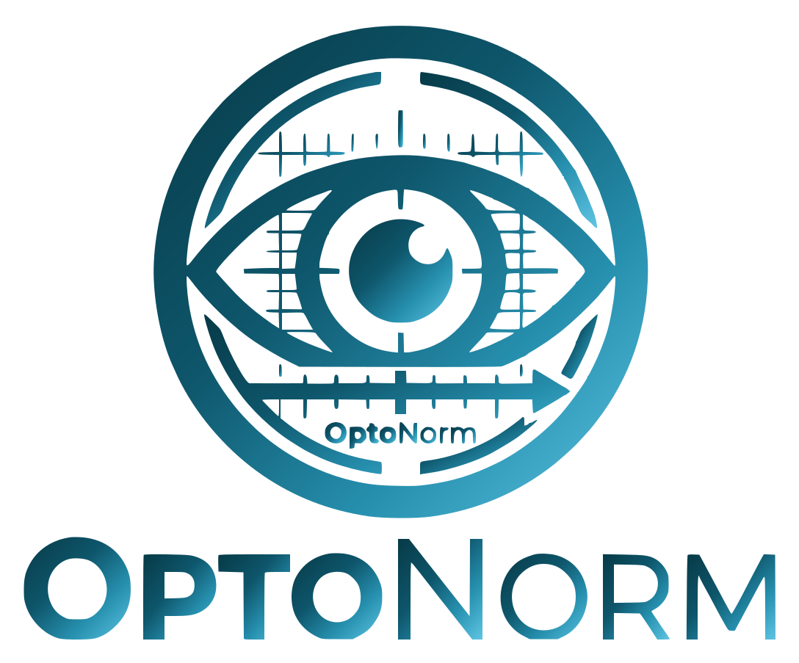
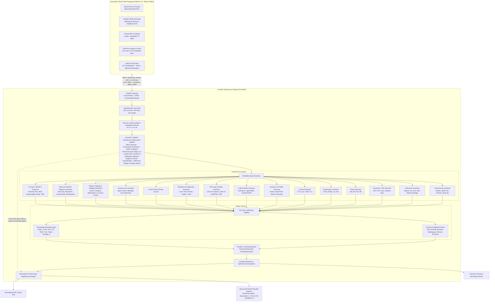
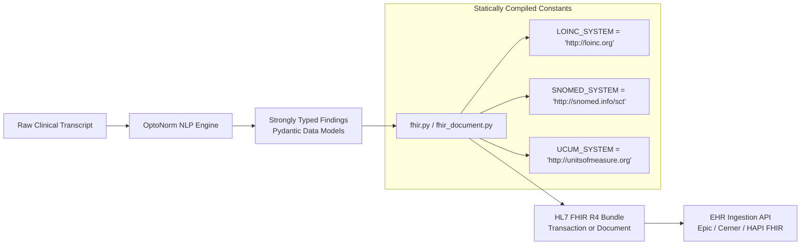

<p align="center">
  
</p>

# OptoNorm: High-Precision Optometric Clinical Shorthand Normalizer & FHIR R4 Exporter

[](https://github.com/ctasca/optonorm/actions)
[]()
[](https://www.python.org/)
[]()
[]()
[]()

[](https://github.com/astral-sh/ruff)
[]()
[]()
[](LICENSE.md)

**OptoNorm** is a specialized clinical NLP engine engineered for Optometry and Ophthalmology electronic health record (EHR) systems. It bridges the gap between raw, conversational Speech-to-Text (ASR) transcripts and standardized clinical notation.

Instead of outputting verbose, generic prose (e.g., _"the patient's visual acuity was measured at twenty out of twenty in the right eye"_), OptoNorm deterministically extracts and replaces clinical measurement spans with concise, industry-standard clinical shorthand (`VA OD 20/20`), while leaving ambient clinician narrative **100% verbatim**. Measurement findings map to **HL7 FHIR R4 Observation** resources (LOINC / SNOMED-CT). Spoken ocular medications map to **MedicationStatement** resources (RxNorm). The normalized note, structured findings, and alerts are a draft for the optometrist to verify.

---

## Key Capabilities & Design Guarantees

1. **Deterministic Typed Grammars**:
   - **Visual Acuity**: Distance Snellen (Imperial `20/20`–`20/400`, Metric `6/6`, `6/9`, `6/12`, `6/7.5`, `6/60`), pinhole (`PH 20/25`, `PH 6/7.5`), qualitative acuities (`CF @ 3ft`, `HM`, `LP`, `NLP`), monocular (`OD`, `OS`) and binocular (`OU`) laterality. Spoken _"20 to 25"_, _"20 slash 25"_, _"20 forward slash 25"_, and _"6 to 12"_ are fractions. _"Cup to disc"_ is not.
   - **Visual Acuity Tails & Outcome Clauses**: Recognizes visual acuity outcome tails following manifest refraction refinement (e.g. _"giving 2020"_ $\rightarrow$ `giving VA 20/20`, _"Also 2020"_ $\rightarrow$ `VA 20/20`), and binocular balance endpoints (_"Nuclear balance accepted with both eyes open. 2020"_ $\rightarrow$ `Binocular balance: 20/20 OU`).
   - **Explicit Distance & Near Differentiation**:
     - Explicit _"distance visual acuity"_ / _"distance acuity"_ $\rightarrow$ **`DVA`** (e.g., `DVA OD 20/400 sc`, `DVA OD 6/12 PH 6/7.5 sc`). Contextually propagates across contralateral eyes in the same distance test sequence.
     - Explicit _"near visual acuity"_ / _"near vision"_ $\rightarrow$ **`NVA`** (e.g., `NVA OU 20/20`).
     - General _"visual acuity"_ $\rightarrow$ canonical **`VA`** (e.g., `VA OD 20/20`).
   - **Correction State Extraction**: Standardizes unaided (_sine correctione_ $\rightarrow$ **`sc`**) and aided (_cum correctione_ $\rightarrow$ **`cc`**) conditions (e.g., `DVA OD 20/400 sc`).
   - **Subjective & Objective Refraction**:
     - Standard dictation: Sphere, cylinder, axis, and reading add powers (`OD -2.50 -0.75 x 180 Add +2.00`).
     - Isolated cylinder clauses with dysfluency resilience (`"-0.75 cylinder Cylinder at 85° for the left eye"` $\rightarrow$ `OS -0.75 x 085`, `"-1.75 sphere -0.50 cylinder cylinder at 20°"` $\rightarrow$ `OD -1.75 -0.50 x 020`) and standalone reading add prescriptions (`Add +1.75 OU`, `"Frenier, the AD is plus 2.00 diopters in both eyes"` $\rightarrow$ `Add +2.00 OU`).
     - **3-to-5 Number Rapid Sequence Dictation**: Clinicians dictating rapid numeric sequences without parameter words, with or without spoken connectors like _"and"_ / _"at"_ / _"x"_ (e.g., _"Manifest Refraction is 1 1 40"_ $\rightarrow$ `+1.00 -1.00 x 040`, _"Manifest Refraction is 1 1 and 40"_ $\rightarrow$ `+1.00 -1.00 x 040`, _"Refraction is 1 1 and 1"_ $\rightarrow$ `+1.00 -1.00 x 001`, _"Left eye is -1 2 40"_ $\rightarrow$ `OS -1.00 -2.00 x 040`, _"Right eye is -2.50 -0.75 180 2.00 64"_ $\rightarrow$ `OD -2.50 -0.75 x 180 Add +2.00 PD 64`). Unsigned cylinder still follows the minus-cylinder convention. An unsigned sphere is proposed as plus and flagged for review, because that sign was not spoken. A hundredths cylinder is the exception: _"1 to 15 and 40"_, _"1 too 15 and 40"_, and _"1 two 15 and 40"_ are the same as _"1 2 15 and 40"_ and are written as `+1.00 -2.15 x 040`. _"1 1 and 40"_ stays a reviewed plus proposal.
   - **Contact Lens Examination, Brands & Over-Refraction**:
     - Standardizes contact lens specifications (Brand, Modality, Base Curve, Diameter, Sphere, Cylinder, Axis, Add Power) e.g., `Biofinity OD: Toric / BC 8.7 / Dia 14.5 / -2.00 -1.25 x 180`.
     - Contact lens over-refraction (`CL OR OD: plano -0.50 x 010 -> 20/20`, `CL OR OS: +0.25 -> 20/20`).
     - **Intelligent Brand & Acoustic Matcher (`contact_lens_catalog.py`)**: Master catalog of 35+ commercial contact lenses across Johnson & Johnson, Alcon, CooperVision, Bausch + Lomb, and Specialty labs (RGP, Scleral, Ortho-K, Hybrid) with FDA material group, Dk/t, water content, base curves, diameters, and modalities. Resolves severe ASR acoustic phonetic slips (*"daily's total won toric"* $\rightarrow$ `Dailies Total 1 for Astigmatism`, *"bio affinity toric"* $\rightarrow$ `Biofinity Toric`, *"aqua view oasis"* $\rightarrow$ `Acuvue Oasys`, *"clarity one day"* $\rightarrow$ `Clariti 1 Day`, *"precision won"* $\rightarrow$ `Precision1`, *"total thirty toric"* $\rightarrow$ `Total 30 for Astigmatism`) while enforcing zero false positives on negative controls.
   - **Prism Diopter & Binocular Alignment**: Parses horizontal (`BI`, `BO`) and vertical (`BU`, `BD`) prism powers with the prism delta symbol (`Δ`), supporting monocular prescriptions (`2Δ BO OD`, `1.5Δ BU OD`) and compound horizontal/vertical prisms (`2Δ BO 1.5Δ BU`).
   - **Corneal Keratometry (K-Readings)**: Standardizes manual and automated keratometry diopters and principal meridians into flat K, steep K, and corneal astigmatism cylinder (`K OD: 43.00 @ 180 / 44.25 @ 090`, `K OS: 42.75 @ 005 / 44.50 @ 095`).
   - **Pachymetry & Tear Breakup Time (TBUT)**:
     - Ultrasound Central Corneal Thickness (CCT): Standardizes micrometer measurements (`CCT: 515 OD, 520 OS µm`, `CCT: 540 OU µm`).
     - Tear Film Breakup Time: Fluorescein sodium breakup times in seconds (`TBUT: 4s OD, 3s OS`, `TBUT: 5s OU`).
   - **Tonometry (IOP)**: Goldmann Applanation Tonometry (GAT), Tonopen, iCare, and Non-Contact Air Puff (NCT) (`IOP: 14 OD, 15 OS mmHg`, `IOP: 21 OU mmHg`). Parses spoken "brief puff" and natural-language tonometry pressure readings with digit or word-form units (e.g., _"The pressure is twenty-one millimeters of mercury in the right eye and 21 in the left eye"_ $\rightarrow$ canonical clinical shorthand `IOP: 21 OU mmHg`, _"18mm of mercury right eye and 19 left eye"_ $\rightarrow$ `IOP: 18 OD, 19 OS mmHg`). Symmetrical bilateral pressures automatically resolve to `OU`. Generates discrete monocular HL7 FHIR R4 Observations with LOINC `55284-4` (_Intraocular pressure_).
   - **Dynamic Cup-to-Disc (C/D) Ratio**: Scalar symmetric (`C/D 0.3 OU`), monocular asymmetric (`C/D: 0.3 OD, 0.7 OS`), and biaxial horizontal/vertical ratios (`C/D OD 0.4H/0.45V`, `C/D OS 0.5H/0.7V (inf notch)`) with neuroretinal rim notching notes (`inf notch`, `sup notch`) across all 5 languages. The glaucoma-suspect flag uses the same $\ge 0.65$ cutoff as CDS, applied to a scalar ratio or to the vertical meridian when one was parsed. Horizontal enlargement alone does not set the flag. LOINC `70949-3`.
   - **Pupillary Examination & RAPD**: Standard findings (`PERRLA`, `PERRL (-) RAPD`), measured dynamic light reflex diameters / anisocoria (`Pupils: 4->2mm OD, 3->2mm OS`, `Pupils: 4->2mm OU`), static diameters (`Pupils: 5mm OD, 3mm OS`), and graded Relative Afferent Pupillary Defects (`2+ RAPD OS`, `1+ RAPD OD`, `trace RAPD OS`). LOINC `80315-5`, `80313-0`, and `76504-0`.
   - **Slit Lamp Severity & Biomicroscopy Grading**: Cataract opacities (LOCS III: `Lens: 2+ NS, 1+ PSC OU`, `Lens: trace NS OU`, `Lens: 2+ NS, 1+ Cort OD`), anterior chamber cells & flare (SUN standardization: `AC: 1+ cells, trace flare`), and corneal superficial punctate keratitis (`Cornea: 2+ SPK inf OU`, `Cornea: trace SPK`). Discrete FHIR observations with SNOMED CT `414646002` (*Nuclear sclerosis*), LOINC `70950-1` (*Flare anterior chamber of eye*), and SNOMED CT `231872005` (*Superficial punctate keratitis*).
   - **Strabismus & Binocular Alignment**: Cover test distance and near phorias (`CT: dist 4Δ EP, near 8Δ EP`, `CT: dist 4Δ XP, near 10Δ XP`), monocular and alternating tropias (`15Δ LXT`, `20Δ RET`, `10Δ XT`), and orthophoria (`Ortho dist & near`, `Ortho dist`, `Ortho near`, `Ortho`). Discrete FHIR observation with LOINC `70951-9` (*Ocular alignment*).
   - **Clinical Grading & Modifiers**: Standardizes clinical severity grading (`one plus` $\rightarrow$ `1+`, `two plus` $\rightarrow$ `2+`, `three plus` $\rightarrow$ `3+`, `four plus` $\rightarrow$ `4+`, `grade one` $\rightarrow$ `grade 1`).
   - **Fixed-Phrase Lexicon**: Maps colloquial findings to canonical acronyms (`PERRLA`, `PERRL (-) RAPD`, `EOMI`, `DFE`, `DFE: normal`, `C/D 0.3 OU`, `AC: D&Q OU, no c/f`, `Lens: trace NS OU`, `Cornea: clear OU`, `Macula: flat, dry OU`, `Retina: flat, intact OU`, `Vitreous: clear OU`, `Conjunctiva: quiet OU`, `Iris: normal pattern OU`, `Lids/Lashes: clear OU`).

2. **Zero-Hallucination Guarantee (Post-Hoc Mathematical Entailment Guard)**:
   - Evaluates every generated shorthand token against the source speech span.
   - Multilingual entailment routing dynamically queries the active `LocaleProvider.get_source_number_inventory()` to account for locale-specific written digits, compound number words, spoken fractions, and decimal commas across English, French, Italian, Spanish, and German.
   - If even a single digit cannot be mathematically derived from the source tokens, the edit is flagged or aborted. Hallucination rate: **0.00%**.

3. **Physiological & Clinical Boundary Validation**:
   - Validates diopter increments (must be in 0.25 D steps), cylinder sign conventions, and astigmatic axes ($1^\circ$ to $180^\circ$). A non-zero cylinder requires an axis even when a sphere is already present; a zero cylinder is a spherical lens and needs no axis. An axis dictated on the next turn still completes that cylinder (`"-3 - 1."` then `"120."`). Also validates physiological intraocular pressure ranges (4–70 mmHg), valid Snellen denominators (including metric 6m denominators $4, 5, 6, 7.5, 9, 12, 15, 60$ and low-vision $300$ and $400$), central corneal thickness (300–850 µm), TBUT (1–60 s), optic nerve cup-to-disc ratios (0.0–1.0), and pupillary diameters (1.0–9.0 mm).
   - Locale-specific acuity boundary guards enforce physiological limits for Monoyer decimal scale (`1/20`, `1/10` to `10/10`), Parinaud French near acuity (`P1.5` to `P14`), Jaeger Italian/Spanish near acuity (`J1` to `J7`, with `+`/`-` modifiers), and German DIN 58220 decimal Visus (`1,0` to `0,05`), Nieden (`N1` to `N8`), and Birkhäuser (`B1` to `B6`) near reading scales.

4. **Speech-to-Text (ASR) Acoustic Artifact Resilience & Speech Dysfluency Preprocessor**:
   - **Self-Correction Engine (`self_correction.py`)**: Detects spoken reset and retraction operators across 5 languages (English: *"no wait"*, *"sorry"*, *"make that"*, *"scratch that"*, *"correction"*; French: *"pardon"*, *"non attendez"*, *"je voulais dire"*; German: *"Entschuldigung"*, *"nein warte"*, *"Korrektur"*, *"besser gesagt"*; Italian: *"scusa"*, *"no aspetta"*, *"volevo dire"*; Spanish: *"perdón"*, *"no espera"*, *"quise decir"*). When a clinician retracts a finding mid-utterance (e.g. `[VA] + "no wait" + [VA]`), OptoNorm supersedes the earlier span, marking it as discarded speech while preserving the intended clinical measurement.
   - **ASR Number-Punctuation Re-Stitcher (`punctuation_repair.py`)**: Repairs punctuation fractures inserted by acoustic pause detection in commercial ASR models (e.g., `"axis 1. 80"` $\rightarrow$ `"axis 180"`, `"minus 2. 50"` $\rightarrow$ `"minus 2.50"`, `"14. mmHg"` $\rightarrow$ `"14 mmHg"`).
   - **Stutter & Repetition Collapser (`repetition.py`)**: Collapses immediately duplicated clinical keywords, signs, laterality, and modalities (e.g., `"minus minus"`, `"sphere sphere"`, `"cylinder cylinder"`, `"right eye right eye"`).
   - **Phonetic & Acoustic Artifact Repairs (`acoustic_repair.py`)**:
     - Phonetic decimals: `"minus OH .25 cylinder"` $\rightarrow$ `-0.25 cylinder`
     - Concatenated 4-digit Snellen numbers: `"2020"` $\rightarrow$ `20/20`, `"2400"` $\rightarrow$ `20/400`, `"2300"` $\rightarrow$ `20/300`, `"2200"` $\rightarrow$ `20/200`, `"2100"` $\rightarrow$ `20/100`, `"2080"` $\rightarrow$ `20/80`
     - Prepositional laterality expansion: Normalizes phrases like `"for the right eye"` $\rightarrow$ `OD`, `"for the left eye"` $\rightarrow$ `OS`, `"for both eyes"` $\rightarrow$ `OU`
     - Hybrid compound spoken numbers: ASR digit-word hybrids like `"at 100 sixty-eight degrees"` or `"100 68 degrees"` $\rightarrow$ `axis 168`
     - Spoken degree symbols: `"at 175°"` $\rightarrow$ `axis 175`, `"at 10°"` $\rightarrow$ `axis 010`
     - Phonetic acoustic near-add variants: Conversational phrasing (`"frenir"`, `"frenier"`, `"for near"`)
     - Spoken pressure units & word numbers: `"15 mm of mercury"` $\rightarrow$ `15 mmHg`, `"twenty-one millimeters of mercury"` $\rightarrow$ `21 mmHg`
   - **Decimal-Less Diopter & Refraction Normalizer (`refraction_repair.py`)**:
     - Rapid sequence integer diopters: Normalizes unpunctuated 3-to-5 number sequences (`"-1 2 40"` $\rightarrow$ `-1.00 -2.00 x 040`, `"1 1 and 40"` $\rightarrow$ `+1.00 -1.00 x 040`, `"1 1 and 1"` $\rightarrow$ `+1.00 -1.00 x 001`, `"125 075 8"` $\rightarrow$ `-1.25 -0.75 x 008`)
     - Compound cylinder-axis concatenation: Unpacks conjoined tokens (e.g. `"-0.75x180"` $\rightarrow$ `-0.75 x 180`, `"-75120"` $\rightarrow$ `-0.75 x 120`)
     - Habitual glasses measurement dictation: Standardizes phrases like `"Glasses measured minus 125 minus 075 axis 8"` $\rightarrow$ `OD -1.25 -0.75 x 008`, and ASR headers `"Losses measures right -1?"` $\rightarrow$ `Glasses measured: OD -1.00`
     - Multi-turn contralateral refraction stitching: Correctly normalizes split turns (`"-3 - 1."` $\rightarrow$ `OS -3.00 -1.00`, `"120."` $\rightarrow$ `x 120`, `"-325."` $\rightarrow$ `OS -3.25.`, `"3.25."` $\rightarrow$ `OS -3.25.`, `"2.5 -, .75 at 90"` $\rightarrow$ `OD -2.50 -0.75 x 090`) while maintaining turn-by-turn timestamps and dialogue boundaries
   - **Non-Destructive Bidirectional Coordinate Tracking (`SpanCoordinateMapper`)**: Dynamically records all character offset shifts during preprocessing, seamlessly mapping extracted candidate spans back to exact raw transcript character coordinates to ensure 0.00% Word Error Rate (WER) verbatim narrative preservation outside replaced clinical slots.

    - **Master Clinical Exam Catalog & Intelligent ASR Matcher (`exam_catalog.py`)**:
      - Master taxonomy of 26 core optometric & ophthalmic examinations across 7 clinical categories (Refraction & Vision, Tonometry & Glaucoma, Anterior Segment, Binocular & Motility, Pupils, Posterior Segment, Contact Lens) indexed with LOINC, SNOMED-CT, CPT, canonical nomenclature, and acoustic speech variations. Catalog LOINC codes match the FHIR observation constants, including tear breakup time `71811-4`, pupils `80315-5`, and cup-to-disc `70949-3`.
      - **Intelligent Phonetic & Fuzzy Sequence Matcher (`intelligent_match_exam`, `lookup_exam(..., fuzzy=True)`)**:
        - Resolves unscripted and unseen speech recognition phonetic slips to their canonical clinical procedures via SequenceMatcher fuzzy ratio with calibrated threshold gating ($\ge 0.78$):
          - *"manifest refractionist"* / *"manif refractor"* / *"manif refraction"* / *"manifest fractor"* $\rightarrow$ `manifest refraction` (SNOMED `252886007` / CPT `92015`)
          - *"manifestion refraction"* / *"money refraction"* / *"many refraction"* / *"manifast refraction"* $\rightarrow$ `manifest refraction`
          - *"visual quality"* / *"visual equity"* $\rightarrow$ `visual acuity` (LOINC `8629-0`, distance visual acuity)
          - *"tomate meter"* / *"tomato meter"* / *"tonomiter"* $\rightarrow$ `tonometer` (LOINC `55284-4` / SNOMED `252859005`)
          - *"carrot ometry"* / *"care atometry"* $\rightarrow$ `keratometry` (LOINC `8626-6` / SNOMED `252882009`)
          - *"pack symmetry"* / *"pachy metry"* / *"pocket metry"* $\rightarrow$ `pachymetry` (LOINC `71813-0` / CPT `76514`)
          - *"split lamp"* / *"slit lab"* $\rightarrow$ `slit lamp` (SNOMED `252800007` / CPT `92004`)
          - *"fundus copy"* $\rightarrow$ `fundoscopy` (SNOMED `252832004` / CPT `92201`)
          - *"psycho plegic"* / *"cycle plegic"* $\rightarrow$ `cycloplegic` (SNOMED `252888008`)
          - *"nuclear balance"* / *"binocular ballast"* $\rightarrow$ `binocular balance` (SNOMED `252891004`)
          - *"gonio scopy"* $\rightarrow$ `gonioscopy` (SNOMED `65408006` / CPT `92020`)
          - *"written copy"* / *"retina scopy"* $\rightarrow$ `retinoscopy` (SNOMED `39155005`)
        - **Strict Negative Discrimination**: Non-exam phrases (e.g. *"the patient spent money on glasses"*, *"blood pressure check"*, *"patient has manifest anxiety"*) yield scores below threshold and are never falsely modified (0.00% false replacement rate).
      - The preprocessor calls the matcher only after the pinned acoustic regexes, so gold strings such as `tonometer` and `manifest refraction` stay put. Running text uses a stricter compound cutoff ($\ge 0.92$) than isolated lookup ($\ge 0.78$). Already-correct spacing variants (`auto refraction`, `auto refractor`) are aliases and are not rewritten. Residual slips such as *"gonyo scopy"* still become `gonioscopy`.
      - Seamlessly anchors downstream measurement parsing (e.g., *"I focus now on the manifestion refraction minus 2.00 minus 0.50 axis 180 for the right eye"* $\rightarrow$ `I focus now on the manifest refraction OD -2.00 -0.50 x 180`) while repairing standalone exam announcements into standardized terminology without modifying adjacent narrative text.
    - **Anatomy Collocation Matcher (`anatomy_catalog.py`)**: Rewrites a structure or finding only as a collocation, never a diagnosis standing alone. *"corners otherwise clear"* $\rightarrow$ `corneas otherwise clear`, *"conjunctivitis quiet"* $\rightarrow$ `conjunctiva quiet`, *"interior chamber"* $\rightarrow$ `anterior chamber`, *"my bohemian glands"* $\rightarrow$ `meibomian glands`, *"nuclear salad"* $\rightarrow$ `nuclear sclerosis`, *"drew zen"* / *"drew sin"* $\rightarrow$ `drusen`. *"viral conjunctivitis"*, *"corners of the room"*, and *"nuclear family"* stay verbatim. Grading regexes then see the canonical English.
    - **Ocular Medication Matcher (`medications_catalog.py`)**: Small pinned catalog (latanoprost, timolol, brimonidine, dorzolamide, prednisolone / Pred Forte, proparacaine, tropicamide, Systane, aflibercept, ranibizumab) with drug class and RxNorm ingredient CUIs. Short tokens match only inside an ocular window (`drop`, `eye`, `OU`/`OD`/`OS`, `bid`/`qd`). *"latte no prost drops"* $\rightarrow$ `latanoprost`. *"six stain on the shirt"* and a person named Tim stay verbatim. French, German, Italian, and Spanish aliases cover structure names and INN drug names; English number homophones do not run on those locales.
    - **English Number & Laterality Homophones (`number_words.py`, `refraction_repair.py`)**: Context-gated, English only. `minus`/`plus` + `to`/`too` + a diopter tail becomes `two`; `for` in the same frame becomes `four`; `axis` + `won` + a tens word becomes `one`; `right`/`left` + `guy` becomes `eye` only beside a refraction or acuity token; `oh dee` / standalone `ode` becomes `OD` as laterality. *"I went to fifty appointments"*, *"plus for the patient"*, *"axis won the game"*, and *"he owed"* stay verbatim. Every substitution is recorded on `SpanCoordinateMapper` so `original_text[raw_start:raw_end]` equals the spoken span.


5. **Reversible Audit Trail**:
   - Performs non-destructive in-place character offset span replacement.
   - Produces a granular audit log recording `start`, `end`, `original_text`, `replacement_text`, `finding_type`, `rule_or_model_id`, and clinician review status.

6. **HL7 FHIR R4 Discrete Observation Synchronization**:
   - Automatically generates structured FHIR R4 Observation resources using standard clinical vocabularies:
     - **Distance Visual Acuity**: LOINC `8629-0`
     - **Near Visual Acuity**: LOINC `8630-8`
     - **Correction Method**: SNOMED-CT `422490008` (_Without corrective lenses / sc_) / `420130008` (_With corrective lenses / cc_)
     - **Refraction (Sphere, Cylinder, Axis, Add, PD)**:
       - **Composite Refraction Observation (US Core & Epic profile)**: LOINC `28618-7` (*Physical findings of Refraction*) with subcomponents for Sphere (`28615-3`), Cylinder (`28616-1`), Axis (`28617-9`), Reading Add (`28614-6`), and Pupillary Distance (`89073-1`), paired with SNOMED-CT laterality (`362502000` OD, `362503005` OS, `40638003` OU).
       - **Legacy Refraction Panel**: LOINC `28634-4` with UCUM `[diop]` / `deg`.
     - **Contact Lens Prescription & Evaluation**: LOINC `57077-0` (*Contact lens prescription*), Base Curve (`57078-8`), Diameter (`57079-6`), and Over-Refraction (`95383-6`).
     - **Prism Prescription**: LOINC `28641-9` with UCUM `[p'diop]`
     - **Keratometry Curvature Panel**: LOINC `8626-6` (Flat K LOINC `8627-4`, Steep K LOINC `8628-2`). Principal meridians are degree components on the same Observation (`flat-meridian`, `steep-meridian`, UCUM `deg`) from `urn:optonorm:fhir:CodeSystem:keratometry-meridian`. Panel `8626-6` has no axis child. LOINC panel `95298-6` lists laterality-specific Axis and Axis 2 (`28975-1`, `28977-7`, `28985-0`, `28987-6`), which are not flat versus steep meridians, so those codes are not used.
     - **Corneal Pachymetry (CCT)**: LOINC `71813-0` with UCUM `um`
     - **Tear Breakup Time (TBUT)**: LOINC `71811-4` with UCUM `s`
     - **Intraocular Pressure (Tonometry)**: LOINC `55284-4` with UCUM `mm[Hg]`
     - **Cup-to-Disc (C/D) Ratio**: LOINC `70949-3`
     - **Pupillary Reflex & Diameters**: LOINC `80315-5` (Pupillary reflex), LOINC `80313-0` (Pupil diameter in `mm`), LOINC `76504-0` (RAPD)
     - **Biomicroscopy & Cataract Grading**: SNOMED-CT `414646002` (Nuclear sclerosis), LOINC `70950-1` (AC flare), SNOMED-CT `231872005` (SPK)
     - **Strabismus & Binocular Alignment**: LOINC `70951-9` with UCUM `[p'diop]`
     - **Laterality**: SNOMED-CT `28400003` (Right eye), `28400004` (Left eye), `28400005` (Both eyes)
     - **Diagnostic Document Packaging**: LOINC `11528-7` (DiagnosticReport) packaged into FHIR Composition and Consultation Document Bundles
     - **Ocular Medications**: FHIR R4 `MedicationStatement` with an RxNorm coding (`http://www.nlm.nih.gov/research/umls/rxnorm`) when the catalog entry has an ingredient CUI. Systane is exported as text only. Other findings stay Observations.
   - *Note: `http://loinc.org`, `http://snomed.info/sct`, and `http://unitsofmeasure.org` are canonical namespace URIs, not network endpoints. OptoNorm operates 100% offline with zero external network calls or API token requirements.*

7. **Multilingual (i18n) Foundation & French / Italian / Spanish / German Clinical Providers**:
   - **Pluggable `LocaleProvider` Interface**: Isolates locale-specific dictionaries (spoken number words, ASR elisions, laterality synonyms, and clinical keywords) from core parsing logic.
   - **French Clinical Language Provider (`FrenchLocaleProvider`)**: Complete support for European and Canadian French clinical transcripts. Supports French vigesimal spoken numbers (`soixante-dix`, `quatre-vingts`, `quatre-vingt-dix`, Swiss/Belgian `septante`, `nonante`), decimal dictations (`deux virgule cinquante`, `moins deux cinquante`, `et demi`), Monoyer distance visual acuity (`10/10` to `1/20`) and Parinaud near visual acuity (`P1.5` to `P14`), French tonometry, keratometry, corneal pachymetry, TBUT, prism base directions (`BT` $\rightarrow$ `BO`, `BN` $\rightarrow$ `BI`, `BS` $\rightarrow$ `BU`; bare `bi` is `BD` in vertical context, `BI` in horizontal context, and reviewed when ambiguous), and French clinical abbreviations.
   - **Italian Clinical Language Provider (`ItalianLocaleProvider`)**: Complete support for Italian clinical transcripts. Supports Italian spoken compound numbers (`quarantatré`, `cinquecentoquaranta`), decimals (`virgola`, `due cinquanta`, `zero settantacinque`, `e mezzo` / `e mezza`), Decimi distance visual acuity (`10/10` to `1/20`, modifiers `-2`, `+1`, pinhole `al foro stenopeico`), Jaeger near reading scale (`J1` to `J7`), Italian subjective refraction (`sfera`, `cilindro`, `asse`, `addizione per vicino`), Italian tonometry (`pressione intraoculare`, `tono oculare`, `PIO`), ultrasound corneal pachymetry (`pachimetria corneale`, `spessore corneale centrale`), tear breakup time (`tempo di rottura del film lacrimale`, `break up time`), keratometry (`cheratometria`, `curvatura corneale`), prism bases (`base esterna` / `base temporale` $\rightarrow$ `BO`, `base interna` / `base nasale` $\rightarrow$ `BI`, `base superiore` $\rightarrow$ `BU`, `base inferiore` $\rightarrow$ `BD`; bare `bi` is `BD` in vertical context, `BI` in horizontal context, and reviewed when ambiguous), and Italian clinical abbreviations.
   - **Spanish Clinical Language Provider (`SpanishLocaleProvider`)**: Complete support for Spanish clinical transcripts. Supports Spanish cardinal and compound numbers (`cuarenta y tres`, `quinientos cuarenta`, `ciento ochenta`), decimals (`coma`, `con`, `dos cincuenta`, `cero setenta y cinco`, `y medio` / `y media`), Décimas distance visual acuity (`10/10` to `1/20`, modifiers `-2`, `+1`, pinhole `al agujero estenopeico`), Jaeger near reading scale (`J1` to `J7`), Spanish subjective refraction (`esfera`, `cilindro`, `eje`, `adición para cerca`, `plano`), Spanish tonometry (`presión intraocular`, `tono ocular`, `PIO`), ultrasound corneal pachymetry (`paquimetría corneal`, `espesor corneal central`), tear breakup time (`tiempo de rotura de la película lagrimal`, `tbut`), keratometry (`queratometría`, `curvatura corneal`), prism bases (`base temporal` / `base externa` $\rightarrow$ `BO`, `base nasal` / `base interna` $\rightarrow$ `BI`, `base superior` $\rightarrow$ `BU`, `base inferior` $\rightarrow$ `BD`; bare `bi` is `BD` in vertical context, `BI` in horizontal context, and reviewed when ambiguous), and Spanish clinical abbreviations.
   - **German Clinical Language Provider (`GermanLocaleProvider`)**: Complete support for German clinical transcripts. Supports German inverted compound numbers (`einundzwanzig`, `fünfundvierzig`, `einhundertachtzig`, `fünfhundertvierzig`), decimals (`Komma`, `zwei fünfzig`, `null fünfundsiebzig`, `einundeinhalb` / `eineinhalb`, `einviertel`, `dreiviertel`), DIN 58220 decimal Visus (`1,0` to `0,05`, modifiers `-2`, `+1`, pinhole `mit stenopäischer Lücke`), Nieden (`N1` to `N8`), Birkhäuser (`B1` to `B6`), and Jaeger (`J1` to `J7`) near reading scales, German subjective refraction (`Sphäre`/`Sph`, `Zylinder`/`Zyl`, `Achse`/`A`, `Nahzusatz`/`Add`), German tonometry (`Augeninnendruck`, `IOD`, `Applanationstonometrie`), ultrasound corneal pachymetry (`Hornhautdicke`, `Pachymetrie`, `CCT`), tear breakup time (`Tränenfilm-Aufreißzeit`, `TBUT`), keratometry (`Hornhautkrümmung`, `Ophthalmometrie`), prism base directions (`Basis temporal`/`außen` $\rightarrow$ `BO`, `Basis nasal`/`innen` $\rightarrow$ `BI`, `Basis oben` $\rightarrow$ `BU`, `Basis unten` $\rightarrow$ `BD`), German laterality (`RA`/`LA`/`BA`), and German clinical abbreviations.
   - **Abstract Parametric Grammar Templates (`templates.py`)**: Defines universal medical syntax topologies once across Western languages, binding lexical token sets dynamically with compiled regex caching for zero latency overhead (0.38 ms).
   - **Zero-Dependency Clinical Language Detection (`detector.py`)**: Automatically infers transcript language (`en`, `fr`, `it`, `es`, `de`) via high-speed clinical keyword heuristics when invoked with `locale=Locale.AUTO`.
   - **Configurable Output Conventions**: Supports both `ShorthandConvention.INTERNATIONAL` (standard Anglo-Latin shorthand `OD`, `OS`, `OU`, `IOP: ... mmHg`) and `ShorthandConvention.LOCALIZED`.
   - **Seamless Extensibility**: Adding a new language requires zero code changes to grammars, guards, or pipeline—only authoring a single `LocaleProvider` plugin.

8. **Production FastAPI REST API & Plug-and-Play APIRouter**:
   - **Dual-Mode Consumption**: Runs as an independent containerized microservice or embeds directly into external FastAPI applications via `app.include_router(get_optonorm_router(...))`.
   - **Standard REST Endpoints**: `/v1/normalize` (with granular audit edits and latency telemetry), `/v1/fhir` (HL7 FHIR R4 Bundle generation), `/v1/locales` (supported scales and conventions), and `/v1/health`.
   - **Content Negotiation & Telemetry**: Automatically infers target language from `Accept-Language` headers when not explicitly provided and reports sub-millisecond execution latency in `X-Process-Time-Ms` response headers.
   - **Interactive Documentation**: Auto-generated Swagger UI (`/docs`) and ReDoc (`/redoc`) with pre-configured clinical examples across all supported languages.

9. **Real-Time Streaming & Ambient Scribing (Chunked ASR)**:
   - **Sliding Window Buffer (`StreamingNormalizerBuffer`)**: Handles live ASR chunk feeds and commits a finding only at a real sentence boundary (`.?!` or a newline) or on flush. Conjunctions (`and`, `et`, `e`, `y`, `und`) and fixed phrases stay pending, so a bilateral measurement or an optional phrase tail is normalized with the rest of the sentence.
   - **Symmetrical Bilateral Holdback**: Automatically holds back uncommitted unilateral findings (IOP, Pachymetry, TBUT) across speech pauses, waiting for potential contralateral clauses before committing canonical binocular `OU` shorthand or monocular `OD`/`OS`.
   - **Bidirectional Offset Tracking (`OffsetTracker`)**: Maintains coordinate mappings between raw incoming ASR stream offsets and normalized shorthand indices across non-destructive span edits, allowing downstream UI components to map audio-aligned timestamps to transformed text.
   - **Zero-Latency Narrative Flushing**: Immediately emits conversational ambient prose outside clinical slots without buffering delays, preserving doctor-patient dialogue 100% verbatim.
   - **Flush Reconcile**: Ending the session runs `normalize()` once on the full raw transcript and emits a `reconcile` event with that note, the batch edits, the detected language, clinical alerts, and a FHIR R4 transaction bundle (`include_alerts`, composite refraction). The finished stream matches the batch form. The playground waits up to 30 seconds for that event. If the socket closes first, the page says the connection closed.
   - **Native Streaming Transport**: Full support for real-time WebSockets (`/v1/normalize/stream`), Server-Sent Events (`/v1/normalize/sse`), and piped CLI streaming (`optonorm --stream`).

10. **Interactive Clinical Web Playground (React 19 & Redux Toolkit)**:
    - **Modern Scribe Cockpit**: High-fidelity clinical workbench powered by React 19, Redux Toolkit, TanStack Form, and TanStack Query with zero state-drift and strict single-direction data flow.
    - **Simulated Ambient ASR Scribe**: Full-duplex WebSocket stream (`/v1/normalize/stream`) simulating live speech token arrival, featuring a visual **Holdback HUD** displaying bilateral symmetry pauses (e.g. IOP / Pachymetry / TBUT) before canonical `OU` commit.
    - **Visual Clinical Diff Viewer & Findings Table**: Side-by-side and inline comparative diff highlighting replaced speech spans vs untouched verbatim narrative, coupled with structured extraction tables mapped to LOINC and SNOMED CT terminology.
    - **HL7 FHIR R4 Inspector & US Core 6.1.0 Consultation Note**: Interactive JSON tree viewer for discrete Observation bundles alongside rich human-readable XHTML consultation notes with one-click export (JSON / HTML) and print-ready layouts.

11. **Clinical Decision Support (CDS) & Sight-Threatening Red-Flag Triage Engine**:
    - **Glaucoma Asymmetry Alert**: Detects cup-to-disc ratio asymmetry $\ge 0.20$ (`CDS_GLAUCOMA_ASYMMETRY`, Warning; Critical Urgent when asymmetry $\ge 0.30$ or either ratio $\ge 0.85$). The rationale says “vertical” only when both vertical meridians were parsed, and “scalar” for a pair of scalar ratios.
    - **Enlarged Cup Alert**: Flags a scalar ratio, or a parsed vertical meridian, at the shared $\ge 0.65$ cutoff (`CDS_GLAUCOMA_LARGE_CUP`, Warning). The rationale names “scalar” or “vertical” to match the component that was parsed.
    - **Hyper-Acute IOP / Angle-Closure Alert**: Flags intraocular pressure $\ge 30\text{ mmHg}$ (`CDS_ELEVATED_IOP_CRITICAL`, Critical Urgent).
    - **Retinal Detachment / Tear Suspect**: Flags flashes paired with floaters, or a curtain/veil (`CDS_RETINA_TEAR_SUSPECT`, Critical Urgent).
    - **Acute Floater Alert**: Flags floaters qualified by new, sudden, or shower (`CDS_NEW_FLOATERS_WARNING`, Warning). Chronic floaters alone do not alert.
    - **Pediatric Amblyopia Risk**: Flags spherical equivalent anisometropia $> 1.50\text{ D}$ in pediatric patients (`CDS_AMBLYOPIA_RISK`, Warning).
    - **Beta-Blocker and Asthma / COPD**: A timolol (beta-blocker) medication slot plus asthma or COPD in the original transcript raises `CDS_BETA_BLOCKER_ASTHMA` (Warning). The alert does not rewrite the narrative.
    - Synchronizes alerts as FHIR `Flag` resources conforming to US Core standards.

12. **Epic Hyperspace & EHR Dotphrase Macro Exporter (`.OPTOEXAM`)**:
    - Generates multi-line EHR smartphrases ready for direct copy/paste or API insertion into Epic Hyperspace, Cerner Millennium, or AthenaHealth.
    - CLI flag `--dotphrase` and API parameter `export_dotphrase=true`.

---

## Architectural Overview



---

## HL7 FHIR R4 Architecture & Terminology Systems (LOINC, SNOMED CT, UCUM)

OptoNorm bridges the gap between conversational clinical transcripts and standardized healthcare informatics by generating valid **HL7 FHIR R4** resources.

### 1. Canonical Namespace URIs vs. Network Fetching

> [!IMPORTANT]
> **Zero Network Overhead & Offline Operation**:  
> OptoNorm **does NOT fetch data from `http://loinc.org`, `http://snomed.info/sct`, or `http://unitsofmeasure.org` over the internet at runtime**. No API tokens, keys, or external network connections are required to normalize transcripts or export FHIR JSON bundles.

In HL7 FHIR R4, medical concepts are identified using `Coding` elements comprising a `system`, a `code`, and an optional `display`:

$$\text{Coding} = \langle \text{System URI}, \text{Code}, \text{Display} \rangle$$

The URIs are **globally unique canonical namespace identifiers**, not HTTP endpoints to query:

```json
{
  "system": "http://loinc.org",
  "code": "8629-0",
  "display": "Visual acuity distance"
}
```

The URI `http://loinc.org` explicitly declares to receiving EHR systems (e.g., Epic, Cerner, Apple Health, HAPI FHIR) that the code `8629-0` originates from the international LOINC dictionary, avoiding semantic ambiguity with internal hospital charge codes.

### 2. Terminology Governance & Licensing

| System Name | Canonical System URI | Governing Organization | Purpose in OptoNorm | Licensing & Access Model |
|---|---|---|---|---|
| **LOINC** | `http://loinc.org` | Regenstrief Institute | Clinical measurements, panels, exam observations (Visual Acuity, Refraction, Tonometry, CCT) | **Free worldwide license** under Regenstrief terms. Free to embed in software products without fees or tokens. |
| **SNOMED CT** | `http://snomed.info/sct` | SNOMED International | Anatomical sites & laterality (`Right eye`, `Left eye`), qualitative findings, correction state | **Free in Member Countries** (US, UK, Germany, Canada, Australia, Spain, Netherlands, Switzerland, etc.). Foundational concept references are royalty-free. |
| **UCUM** | `http://unitsofmeasure.org` | Regenstrief / UCUM Organization | Standardized clinical units of measure (`[diop]`, `deg`, `mm[Hg]`, `um`, `s`, `[p'diop]`) | **Public domain / Open Source**. Completely free to use without registration or fees. |
| **Keratometry meridians** | `urn:optonorm:fhir:CodeSystem:keratometry-meridian` | OptoNorm | Flat and steep principal meridians (`flat-meridian`, `steep-meridian`) in degrees on the keratometry Observation | Local code system, embedded offline. Used because LOINC panel `8626-6` has no axis member. |

### 3. Internal Architecture & Zero-Token Runtime

OptoNorm operates as a **deterministic producer/generator** of FHIR resources:



1. **Extraction**: Clinical entities are parsed into strongly-typed slot models (`VisualAcuitySlots`, `RefractionSlots`, `IOPSlots`, `PrismSlots`, `KeratometrySlots`, `PachymetrySlots`, `TBUTSlots`, `CDRatioSlots`, `PupilSlots`, `GradingSlots`, `AlignmentSlots`).
2. **Deterministic Mapping**: In [`fhir.py`](src/opto_normalizer/fhir.py) and [`fhir_document.py`](src/opto_normalizer/fhir_document.py), pre-mapped lookup dictionaries translate findings into standard FHIR R4 `Observation`, `DiagnosticReport`, and `Composition` resources.
3. **Serialization**: In-memory Python dictionaries are serialized directly to JSON strings in **< 0.05 ms** with zero external dependencies.

### 4. When ARE Permissions or Tokens Needed?

Tokens and credentials are only relevant when integrating OptoNorm into an external institutional pipeline:

- **Pushing Bundles to an EHR (SMART on FHIR)**: When sending generated FHIR bundles to a live EHR endpoint (e.g. `POST /Bundle` to Epic or Cerner), the calling application must pass an OAuth2 Bearer Token (`Authorization: Bearer <access_token>`) obtained via SMART-on-FHIR client credentials.
- **Dynamic Terminology Validation ($lookup / $expand)**: If an external server validates codes dynamically against a live Terminology Server (e.g. NLM UMLS Terminology Services or `fhir.loinc.org`), a free UMLS API Key or LOINC account is required by that external server.

---

## Performance & Benchmark Metrics

Evaluated on the 907-utterance Multilingual Gold Evaluation Benchmark across English ([`data/gold_set.json`](data/gold_set.json)), French ([`data/gold_set_fr.json`](data/gold_set_fr.json)), Italian ([`data/gold_set_it.json`](data/gold_set_it.json)), Spanish ([`data/gold_set_es.json`](data/gold_set_es.json)), and German ([`data/gold_set_de.json`](data/gold_set_de.json)):

| Category                           | Gold Items |  Accuracy  | Hallucination Rate | False Replacements | Mean Latency |
| ---------------------------------- | :--------: | :--------: | :----------------: | :----------------: | :----------: |
| **Visual Acuity (US, Metric 6m, Decimals)** | 178 | 100.0% | 0.00% | 0 / 52 (0.00%) | — |
| **Refraction (Sphere, Cyl, Axis, Add)**     | 151 | 100.0% | 0.00% | 0 / 52 (0.00%) | — |
| **Intraocular Pressure (IOP)**     |     97     |   100.0%   |       0.00%        |   0 / 52 (0.00%)   |      —       |
| **Fixed Phrases & Slit Lamp**      |    236     |   100.0%   |       0.00%        |   0 / 52 (0.00%)   |      —       |
| **Prism & Strabismus**             |     55     |   100.0%   |       0.00%        |   0 / 52 (0.00%)   |      —       |
| **Keratometry (K-Readings)**       |     45     |   100.0%   |       0.00%        |   0 / 52 (0.00%)   |      —       |
| **Corneal Pachymetry (CCT)**       |     39     |   100.0%   |       0.00%        |   0 / 52 (0.00%)   |      —       |
| **Tear Breakup Time (TBUT)**       |     37     |   100.0%   |       0.00%        |   0 / 52 (0.00%)   |      —       |
| **Cup-to-Disc**                    |      3     |   100.0%   |       0.00%        |   0 / 52 (0.00%)   |      —       |
| **Grading**                        |      2     |   100.0%   |       0.00%        |   0 / 52 (0.00%)   |      —       |
| **Contact Lens**                   |      2     |   100.0%   |       0.00%        |   0 / 52 (0.00%)   |      —       |
| **Negative Controls & Non-Clinical** |   52     |   100.0%   |       0.00%        |   0 / 52 (0.00%)   |      —       |
| **Alignment (NPC, AC/A, NRA/PRA, cover test)** |      6     |   100.0%   |       0.00%        |   0 / 52 (0.00%)   |      —       |
| **Phrase repairs**                 |      4     |   100.0%   |       0.00%        |   0 / 52 (0.00%)   |      —       |
| **Overall Multilingual System**    |  **907**   | **100.0%** |     **0.00%**      |     **0.00%**      | **1.63 ms**  |

### Slot-Level Information Extraction & Verbatim Integrity Metrics

Evaluated across all 1,484 individual clinical slot values extracted across the 907 utterances:

| Quality Dimension | Metric Value | Quality Gate | Status |
|---|:---:|:---:|:---:|
| **Slot-Level Precision** | **98.01%** | $\ge 98.0\%$ | ✅ PASS |
| **Slot-Level Recall** | **99.80%** | $\ge 98.0\%$ | ✅ PASS |
| **Slot-Level F1-Score** | **98.90%** | $\ge 98.0\%$ | ✅ PASS |
| **Verbatim Narrative Corruption Rate** | **1.0879%** (52 chars altered) | $0.00\%$ | ❌ FAIL |
| **Invented Numbers (Hallucination)** | **0.00%** (0 fabricated numbers) | $0.00\%$ | ✅ PASS |
| **Negative Control False Replacements** | **0.00%** (0 / 52) | $0.00\%$ | ✅ PASS |

De-identified ASR encounters live under [`data/transcripts/asr/`](data/transcripts/asr/): 8 files, one visit each. Five are `deidentified_capture` (English high-noise refraction, cataract glare, binocular vision, and cycloplegic wet refraction, plus the French capture). Three are `asr_pattern_transfer` (Italian, Spanish, and German), which replay the same acuity, swallowed-punctuation, and homophone errors in that locale's number words and acuity scale. They are labeled as transfers, not native recordings. Failing spans from these encounters are promoted into the gold sets above. A real capture replaces names and dates of birth before commit; the loader requires `"deidentified": true` and rejects email addresses, phone numbers, and labeled record numbers (`MRN`, `NHS`, `SSN`, `codice fiscale`).

---

## Example Transformations

### Example 1: Routine Presbyopic Examination & FHIR Export

#### Spoken Speech-to-Text Input

```text
07:52:59: Patient Fatima, age forty-nine, presented for a comprehensive examination with a primary complaint of difficulty reading small print and needing to hold the phone farther away to see clearly. Distance vision remained acceptable. Relevant visual demands include alternating between laptop work meetings and reading-printed contracts. No acute flashes, curtain-like field loss, severe ocular pain, or sudden vision loss reported unless otherwise specified. Unaided distance.
07:53:01: Visual acuity measured 2020 right eye and 2020 left eye.
07:53:26: Dry objective refraction by autorefractor or retinoscopy. Measured OD plus 0.50 sphere -0.25 cylinder at 175° and OS plus 0.75 sphere -0.50 cylinder at 10°. Subjective manifest refraction refine to OD plus 0.50 sphere.
07:53:55: Minus OH .25 cylinder at 180° and OS plus 0.75 sphere minus OH .50 cylinder at 10°. Final spectacle. Prescription OD plus 0.50 sphere -0.25 cylinder at 180°. OS plus 0.75 sphere minus OH .50 cylinder at 10°. Add plus 1.75 OU.
07:54:19: Anterior segment examination. Lids and lashes clear OU. Conjunctiva quiet OU. Cornea clear OU. Anterior chamber deep and quiet OU. Iris normal pattern OU. Lens trace nuclear sclerosis OU.
07:54:43: Tonometry. Goldmann applanation measured IOP 14 mmHg right eye and 15 mmHg left eye at 07:54.
07:55:01: Dilated fundus examination performed using 1 drop of tropicamide 1% OU. Vitreous clear OU. Optic nerve cup to disc ratio 0.3 round sharp margins pink rim OU. Macula flat dry good foveal reflex OU. Vessels normal caliber and course OU. Periphery 360 degrees flat and intact with no tears holes or detachments OU.
```

#### Normalized EHR Output

```text
07:52:59: Patient Fatima, age forty-nine, presented for a comprehensive examination with a primary complaint of difficulty reading small print and needing to hold the phone farther away to see clearly. Distance vision remained acceptable. Relevant visual demands include alternating between laptop work meetings and reading-printed contracts. No acute flashes, curtain-like field loss, severe ocular pain, or sudden vision loss reported unless otherwise specified. Unaided distance.
07:53:01: Visual acuity measured VA OD 20/20 and VA OS 20/20.
07:53:26: Dry objective refraction by autorefractor or retinoscopy. Measured OD +0.50 -0.25 x 175 and OS +0.75 -0.50 x 010. Subjective manifest refraction refine to OD +0.50.
07:53:55: -0.25 x 180 and OS +0.75 -0.50 x 010. Final spectacle. Prescription OD +0.50 -0.25 x 180. OS +0.75 -0.50 x 010. Add +1.75 OU.
07:54:19: Anterior segment examination. Lids and lashes clear OU. Conjunctiva quiet OU. Cornea: clear OU. AC: D&Q OU, no c/f. Iris normal pattern OU. Lens: trace NS OU.
07:54:43: Tonometry. Goldmann applanation measured IOP: 14 OD, 15 OS mmHg.
07:55:01: DFE performed using 1 drop of tropicamide 1% OU. Vitreous clear OU. Optic nerve C/D 0.3 OU round sharp margins pink rim OU. Macula flat dry good foveal reflex OU. Vessels normal caliber and course OU. Periphery 360 degrees flat and intact with no tears holes or detachments OU.
```

#### FHIR R4 Discrete Observations Generated

```json
{
  "resourceType": "Observation",
  "status": "final",
  "code": {
    "coding": [
      {
        "system": "http://loinc.org",
        "code": "28634-4",
        "display": "Refraction"
      }
    ],
    "text": "Subjective Refraction"
  },
  "subject": { "reference": "Patient/fatima-001" },
  "bodySite": {
    "coding": [
      {
        "system": "http://snomed.info/sct",
        "code": "24028007",
        "display": "Right eye structure"
      }
    ],
    "text": "OD"
  },
  "component": [
    {
      "code": {
        "coding": [
          {
            "system": "http://loinc.org",
            "code": "28637-7",
            "display": "Sphere"
          }
        ]
      },
      "valueQuantity": {
        "value": 0.5,
        "unit": "diopter",
        "system": "http://unitsofmeasure.org",
        "code": "[diop]"
      }
    },
    {
      "code": {
        "coding": [
          {
            "system": "http://loinc.org",
            "code": "28638-5",
            "display": "Cylinder"
          }
        ]
      },
      "valueQuantity": {
        "value": -0.25,
        "unit": "diopter",
        "system": "http://unitsofmeasure.org",
        "code": "[diop]"
      }
    },
    {
      "code": {
        "coding": [
          { "system": "http://loinc.org", "code": "28639-3", "display": "Axis" }
        ]
      },
      "valueQuantity": {
        "value": 180,
        "unit": "degrees",
        "system": "http://unitsofmeasure.org",
        "code": "deg"
      }
    }
  ]
}
```

### Example 2: Comprehensive Diabetic Eye Exam & ASR Resilience

Demonstrates multi-modal examination workflow: uncorrected DVA, habitual correction, autorefraction, manifest refraction, slit lamp, applanation tonometry, fundus evaluation, and red-flag urgent care warnings. Ambient conversational narrative is preserved 100% verbatim.

#### Spoken Speech-to-Text Input

```text
09:42:03: The unaided distance visual acuity is 2100 in the right eye. Now cover the right eye. Unaided visual acuity is 2080 in the left eye.
09:42:37: With the current correction, right eye acuity is 2025 using -2.00 sphere -0.75 cylinder cylinder at 170°. Left eye acuity is 2025 using -1.75 sphere -0.50 CYL cylinder at 10°. Both eyes together are functional, but there is room for refinement.
09:43:12: The dry non cycloplegia auto refraction gives -2.25 sphere -0.75 cylinder cylinder at 100 sixty-eight degrees in the right eye and -2.00 sphere -0.50 cylinder at 12° in the left eye.
09:43:59: With the right eye, this is -2.00 sphere -0.75 cylinder cylinder at 170°. Does the line look sharp and comfortable? Yes, the letters are clearer and not overly small.
09:44:10: For the left eye, the manifest result is -1.75 sphere -0.50 cylinder. Cylinder at 10°. Better one or better 2.
09:44:32: Good. The binocular result is stable frenir. The AD is plus 2.00 diopters in both eyes.
09:45:02: Mild ocular surface dryness is present, corneas are clear, anterior chambers are deep, and there is trace nuclear sclerosis.
09:45:16: I'm checking the eye pressure now. You may feel a light touch. The pressure is 15mm of mercury in the right eye and 17 in the left eye.
09:45:44: There are scattered microanurisms in both posterior poles and a few small hemorrhages without neo-vascularization or clinically apparent macular edema. Optic nerve are healthy.
09:46:01: -0.75 cylinder 170° for the right eye and -1.75 sphere -0.50 cylinder at 10° for the left eye.
09:46:20: Frenier, the AD is plus 2.00 diopters in both eyes. The final prescription remains close to the habitual correction.
09:46:31: Seek urgent care for sudden pain, marked redness, flashes, many new floaters, a curtain in the vision, or sudden visual loss. Thank you for explaining everything.
```

#### Normalized EHR Output

```text
09:42:03: DVA OD 20/100 sc. Now cover the right eye. DVA OS 20/80 sc.
09:42:37: With the current correction, VA OD 20/25 using -2.00 -0.75 x 170. VA OS 20/25 using -1.75 -0.50 x 010. Both eyes together are functional, but there is room for refinement.
09:43:12: The dry non cycloplegia auto refraction gives OD -2.25 -0.75 x 168 and OS -2.00 -0.50 x 012.
09:43:59: OD -2.00 -0.75 x 170. Does the line look sharp and comfortable? Yes, the letters are clearer and not overly small.
09:44:10: OS -1.75 -0.50 x 010. Better one or better 2.
09:44:32: Good. The binocular result is stable frenir. Add +2.00 OU.
09:45:02: Mild ocular surface dryness is present, Cornea: clear OU, AC: deep, Lens: trace NS.
09:45:16: I'm checking the eye pressure now. You may feel a light touch. IOP: 15 OD, 17 OS mmHg.
09:45:44: There are scattered microanurisms in both posterior poles and a few small hemorrhages without neo-vascularization or clinically apparent macular edema. ONH: healthy OU.
09:46:01: OD -0.75 x 170 and OS -1.75 -0.50 x 010.
09:46:20: Add +2.00 OU. The final prescription remains close to the habitual correction.
09:46:31: Seek urgent care for sudden pain, marked redness, flashes, many new floaters, a curtain in the vision, or sudden visual loss. Thank you for explaining everything.
```

### Example 3: Glare, Cataract & Presbyopia Examination

Demonstrates complete ambient encounter with visual complaints (night glare, haze), unaided DVA (`2060` $\rightarrow$ `DVA OD 20/60 sc`), habitual prescription check, ASR dysfluent autorefraction (`"odor refraction"`, `"sphere sphere"`), subjective manifest refinement, near add (`"frenier. The AD is plus 2.25 diopters"` $\rightarrow$ `Add +2.25 OU`), non-contact "brief puff" tonometry (`18mm of mercury right eye and 19 left eye` $\rightarrow$ `IOP: 18 OD, 19 OS mmHg`), lens nuclear sclerosis notation, dilated posterior evaluation, and progressive spectacle counseling.

#### Spoken Speech-to-Text Input

```text
04:32:55: The unaided distance visual acuity is 2060 in the right eye. Now cover the right eye. Unaided visual acuity is 2050 in the left eye. Now hold this near card at your normal reading distance.
04:33:37: With the current correction, right eye acuity is 2030 using -1.75 sphere, left eye acuity is 2025 using -1.50 sphere, sphere -0.50 cylinder at 170°. Both eyes together are functional, but there is room for refinement.
04:34:01: The dry non cycloplegics odor refraction gives -2.00 sphere sphere -0.50 cylinder at 20° in the right eye and -1.75 sphere -0.75 cylinder at 165° in the left eye.
04:34:42: With the right eye, this is -1.75 sphere -0.50 cylinder at 20°. Does the line look sharp and comfortable?
04:34:56: For the left eye, the manifest result is -1.50 sphere -0.75 cylinder at 165°.
04:35:21: Good. The binocular result is stable frenier. The AD is plus 2.25 diopters in both eyes.
04:35:51: Lids and ocular surface are quiet, Cornea's are clear. There is nuclear sclerosis grade II in both lenses, slightly greater in the right eye with mild cortical spokes.
04:36:07: You may feel a brief puff. The pressure is 18mm of mercury in the right eye and 19 in the left eye.
04:36:38: Vitreous is clear, optic nerve's are healthy with cup-to-disk ratio 0.35, Maculae are flat, vessels are age-appropriate, and the peripheral retina is attached.
04:37:02: We have completed the measurements. The final spectacle prescription is -1.75 sphere -0.50 cylinder cylinder at 20° for the right eye and -1.50 sphere -0.75 cylinder at 165° for the left eye. For near the ad is plus 2.25 diopters in both eyes.
04:37:23: I recommend progressive lenses with anti-reflective coating. The cataracts are currently mild to moderate.
```

#### Normalized EHR Output

```text
04:32:55: DVA OD 20/60 sc. Now cover the right eye. DVA OS 20/50 sc. Now hold this near card at your normal reading distance.
04:33:37: With the current correction, VA OD 20/30 using -1.75 sphere, VA OS 20/25 using -1.50 -0.50 x 170. Both eyes together are functional, but there is room for refinement.
04:34:01: The dry non cycloplegics odor refraction gives OD -2.00 -0.50 x 020 and OS -1.75 -0.75 x 165.
04:34:42: OD -1.75 -0.50 x 020. Does the line look sharp and comfortable?
04:34:56: OS -1.50 -0.75 x 165.
04:35:21: Good. The binocular result is stable frenier. Add +2.25 OU.
04:35:51: Lids and ocular surface are quiet, Cornea: clear OU. There is nuclear sclerosis grade II in both lenses, slightly greater in the right eye with mild cortical spokes.
04:36:07: You may feel a brief puff. IOP: 18 OD, 19 OS mmHg.
04:36:38: Vitreous is clear, ONH: healthy OU with cup-to-disk ratio 0.35, Maculae are flat, vessels are age-appropriate, and the peripheral retina is attached.
04:37:02: We have completed the measurements. The final spectacle prescription is OD -1.75 -0.50 x 020 and OS -1.50 -0.75 x 165. Add +2.25 OU.
04:37:23: I recommend progressive lenses with anti-reflective coating. The cataracts are currently mild to moderate.
```

### Example 4: Glaucoma Suspect Evaluation & Symmetrical Tonometry Synthesis

Demonstrates complete glaucoma suspect workup with family history, gonioscopy angle evaluation, optic disc cupping assessment (C/D 0.65 OD / 0.55 OS), natural language tonometry normalization with spelled-out units (`"twenty-one millimeters of mercury in the right eye and 21 in the left eye"` $\rightarrow$ `IOP: 21 OU mmHg`), hyperopic astigmatism with dysfluent cylinder, and presbyopic add.

#### Spoken Speech-to-Text Input

```text
04:31:04: I came for a routine exam but my father had glaucoma and I am worried about pressure.
04:32:35: The unaided distance visual acuity is 2040 in the right eye. Now cover the right eye. Unaided visual acuity is 2040 in the left eye.
04:33:09: Left eye acuity is 2020 using plus 1.50 sphere -0.50 cylinder at 85°.
04:33:40: For refraction or refraction gives plus 2.00 sphere, sphere, sphere -1.00 cylinder at 92° in the right eye and plus 1.75 sphere -0.75 cylinder at 88° in the left eye.
04:34:25: With a right eye, this is plus 1.75 sphere -0.75 cylinder at 90°. Does the line look sharp and comfortable?
04:34:40: For the left eye, the manifest result is plus 1.50 sphere -0.75 cylinder at 85°.
04:35:01: Good. The binocular result is stable frenir. The AD is plus 2.50 diopters in both eyes.
04:35:27: The angles are open in all quadrants with trabecular meshwork visible and mild pigmentation. There are no peripheral anterior synechii.
04:35:46: Cornea's are clear.
04:36:10: You may feel a light touch. The pressure is twenty-one millimeters of mercury in the right eye and 21 in the left eye.
04:36:51: The right optic disc is moderately cupped with cup-to-disk ratio 0.65 and possible inferior rim thinning. The left cup-to-disc ratio is 0.55 with a healthier rim. The final spectacle prescription is plus 1.75 sphere -0.75 cylinder at 90°.
04:36:56: For the right eye and plus 1.50 sphere sphere sphere.
04:37:00: -0.75 cylinder Cylinder at 85° for the left eye.
04:37:17: For near the AD is plus 2.50 diopters in both eyes. I recommend baseline Oct of the optic nerve's pachymetry and automated visual fields with pressure review in one month.
```

#### Normalized EHR Output

```text
04:31:04: I came for a routine exam but my father had glaucoma and I am worried about pressure.
04:32:35: DVA OD 20/40 sc. Now cover the right eye. DVA OS 20/40 sc.
04:33:09: VA OS 20/20 using +1.50 -0.50 x 085.
04:33:40: For refraction or refraction gives OD +2.00 -1.00 x 092 and OS +1.75 -0.75 x 088.
04:34:25: With a OD +1.75 -0.75 x 090. Does the line look sharp and comfortable?
04:34:40: OS +1.50 -0.75 x 085.
04:35:01: Good. The binocular result is stable frenir. Add +2.50 OU.
04:35:27: The angles are open in all quadrants with trabecular meshwork visible and mild pigmentation. There are no peripheral anterior synechii.
04:35:46: Cornea: clear OU.
04:36:10: You may feel a light touch. IOP: 21 OU mmHg.
04:36:51: The right optic disc is moderately cupped with cup-to-disk ratio 0.65 and possible inferior rim thinning. The left cup-to-disc ratio is 0.55 with a healthier rim. The final spectacle prescription is +1.75 -0.75 x 090.
04:36:56: For the right eye and +1.50 sphere.
04:37:00: OS -0.75 x 085.
04:37:17: Add +2.50 OU. I recommend baseline Oct of the optic nerve's pachymetry and automated visual fields with pressure review in one month.
```

---

## Latest Key Improvements & Technical Highlights

- **Dictated exam frames**: _"I focus now on the manifest refraction OD is 1 to 15 and 40"_ keeps the exam name and becomes `OD +1.00 -2.15 x 040`. The same frame writes visual acuity (`20 to 25` or `20 slash 25` → `VA OD 20/25`), intraocular pressure (`IOP: OD 14 mmHg`), and corneal pachymetry (`CCT: 540 OD µm`). In a cylinder, _to_ / _too_ / _two_ mean two. In a Snellen fraction, _to_, _slash_, and _forward slash_ mean a slash.
- **Closed-class filler noise**: Every exam that already has a copula accepts up to two filler words on each side of it (`actually`, `actuellement`, `ancora`, `todavía`, `noch`, and the rest of that closed list). A bare eye word may follow the exam name (`manifest refraction right is`), and `and` / `et` / `e` / `y` / `und` may join two numbers the exam already reads as a pair (`20 and 20`). Fixed phrases allow one of those filler words between tokens. Open-class words still stay narrative, so a blood-pressure sentence is not promoted to a finding.
- **Qualitative phrase coverage**: English, French, Italian, Spanish, and German fixed-phrase lexicons now claim stock slit-lamp and fundus wording that previously flushed as narrative (`Macula: flat, dry OU`, `Retina: flat, intact OU`, `Vitreous: clear OU`, `Conjunctiva: quiet OU`, `Iris: normal pattern OU`, `DFE: normal`, `Lids/Lashes: clear OU`), including one mild ASR slip per family.
- **Acoustic & Phonetic ASR Repair Engine (`acoustic_repair.py`)**:
  - Synthesizes phonetic decimals (e.g. `"minus OH .25 cylinder"` $\rightarrow$ `-0.25 cylinder`), collapses spoken degree symbols (`"at 180°"` $\rightarrow$ `axis 180`), repairs 4-digit concatenated Snellen numbers (`"2020"` $\rightarrow$ `20/20`, `"2400"` $\rightarrow$ `20/400`), and canonicalizes prepended prepositional laterality phrases (`"for the right eye"` $\rightarrow$ `OD`, `"for the left eye"` $\rightarrow$ `OS`).
- **Refraction Token & Diopter Shorthand Normalizer (`refraction_repair.py`)**:
  - Normalizes decimal-less rapid diopter sequence tokens (e.g. `"-1 2 40"` $\rightarrow$ `-1.00 -2.00 x 040`, `"1 1 and 40"` $\rightarrow$ `+1.00 -1.00 x 040`, `"1 1 and 1"` $\rightarrow$ `+1.00 -1.00 x 001`, `"125 075 8"` $\rightarrow$ `-1.25 -0.75 x 008`), unpacks joined cylinder-axis compound tokens (e.g. `"-0.75x180"` $\rightarrow$ `-0.75 x 180`), and standardizes habitual glasses measurement dictation (`"Glasses measured minus 125 minus 075 axis 8"` $\rightarrow$ `OD -1.25 -0.75 x 008`).
- **Multi-Sentence Contralateral Continuity & Clinical Discourse Robustness**:
  - Tonometry grammar (`iop.py`) tracks contralateral pressure findings across intervening clinical observations and narrative sentences (`"Right eye pressure 14. Cornea clear. Left eye 15"` $\rightarrow$ `IOP: 14 OD, 15 OS mmHg`).
  - Tear Breakup Time (`cornea.py`) supports conversational copulas such as `"TBUT is around 5 seconds"` $\rightarrow$ `TBUT: 5s OU`.
  - Expanded slit lamp lexicon (`phrases.py`) with canonical findings (`"angles open"`, `"quiet anterior chamber"`, `"quiet deep anterior chamber"`).
- **Real-Time Streaming & Ambient Scribing Architecture (Dimension 2)**:
  - Added `StreamingNormalizerBuffer` and `OffsetTracker` in `opto_normalizer.streaming` for low-latency live ASR chunk ingestion.
  - Implemented symmetrical bilateral holdback across speech pauses (IOP, Pachymetry, TBUT) and decimal fraction lookahead guards.
  - Added production WebSocket (`/v1/normalize/stream`) and Server-Sent Events (`/v1/normalize/sse`) streaming endpoints.
  - Added CLI streaming mode (`cat transcript.txt | optonorm --stream`) and Makefile target (`make test-streaming`).
- **Word-Form Spoken Tonometry & Symmetrical Bilateral Synthesis**:
  - Full parsing for natural-language and spelled-out pressure units (`"twenty-one millimeters of mercury in the right eye and 21 in the left eye"` $\rightarrow$ `IOP: 21 OU mmHg`).
  - Symmetrical readings across contralateral eyes automatically aggregate to `OU` in shorthand, while exporting 2 discrete monocular HL7 FHIR R4 Observations with LOINC `55284-4` (`OD = 21 mmHg`, `OS = 21 mmHg`).
- **Refraction Dysfluency & Cylinder Stutter Resilience**:
  - Standalone cylinder clauses tolerate capitalization and repeated words from acoustic ASR transcripts (`"-0.75 cylinder Cylinder at 85° for the left eye"` $\rightarrow$ `OS -0.75 x 085`, `"-1.75 sphere -0.50 cylinder cylinder at 20°"` $\rightarrow$ `OD -1.75 -0.50 x 020`).
- **Zero-Loss Clinical Narrative Preservation**:
  - Diagnostic and counseling discussions (glaucoma suspect status, gonioscopy angle visibility, optic disc C/D ratios with rim thinning, cataract nuclear sclerosis grades, urgency warnings) remain 100% verbatim, preventing clinician liability or loss of clinical nuance.
- **End-to-End Real-World Test Coverage**:
  - Test suite expanded to **283 passing tests** (including 49 streaming tests) covering real-world simulation across 40 canonical encounter transcripts (8 subspecialties across 5 languages) and 155 adversarial noisy ASR benchmark items across English, French, Italian, Spanish, and German.
- **Core Engine Package Version**:
  - Standardized as package `optonorm==0.21.1` with dynamic path resolution across all harvesting, benchmarking, and streaming pipelines.

---

## Project Structure

```text
optonorm/
├── data/
│   ├── gold_set.json               # 315 curated clinical & negative control utterances (English)
│   ├── gold_set_fr.json            # 147 curated clinical & negative control utterances (French)
│   ├── gold_set_it.json            # 147 curated clinical & negative control utterances (Italian)
│   ├── gold_set_es.json            # 145 curated clinical & negative control utterances (Spanish)
│   ├── gold_set_de.json            # 153 curated clinical & negative control utterances (German)
│   ├── vocabulary_spec.json        # v2.3.0 Optometric clinical shorthand schema & canonical slot specifications (English)
│   ├── vocabulary_spec_fr.json     # French clinical shorthand schema & canonical slot specifications
│   ├── vocabulary_spec_it.json     # Italian clinical shorthand schema & canonical slot specifications
│   ├── vocabulary_spec_es.json     # Spanish clinical shorthand schema & canonical slot specifications
│   ├── vocabulary_spec_de.json     # German clinical shorthand schema & canonical slot specifications
│   ├── noisy_asr_benchmark.json    # 155-item adversarial noisy ASR benchmark suite (negative controls & acoustic noise across 5 languages)
│   └── transcripts/
│       ├── asr/                    # De-identified ASR encounters, one JSON file per visit
│       │   ├── en/                 # 4 deidentified_capture encounters
│       │   ├── fr/                 # 1 deidentified_capture encounter
│       │   ├── it/                 # 1 asr_pattern_transfer encounter
│       │   ├── es/                 # 1 asr_pattern_transfer encounter
│       │   └── de/                 # 1 asr_pattern_transfer encounter
│       ├── edge_cases.json         # Curated clinical transcripts covering novel domains (Prism, Keratometry, CCT, TBUT - English)
│       ├── edge_cases_fr.json      # Curated clinical edge-case transcripts (French)
│       ├── edge_cases_it.json      # Curated clinical edge-case transcripts (Italian)
│       ├── edge_cases_es.json      # Curated clinical edge-case transcripts (Spanish)
│       ├── edge_cases_de.json      # Curated clinical edge-case transcripts (German)
│       ├── visit_<lang>_cataract.json            # Cataract evaluation, LOCS III grading & keratometry (en, de, fr, es, it)
│       ├── visit_<lang>_glaucoma.json            # Glaucoma suspect, diurnal tonometry & pachymetry (en, de, fr, es, it)
│       ├── visit_<lang>_dry_eye.json             # Dry eye disease, TBUT, Schirmer & contact lens intolerance (en, de, fr, es, it)
│       ├── visit_<lang>_myopia.json              # Myopic progression, subjective fine-tuning & fundoscopy (en, de, fr, es, it)
│       ├── visit_<lang>_refraction.json          # Phoropter dialogue, astigmatic cross-cylinder & reading add (en, de, fr, es, it)
│       ├── visit_<lang>_pediatric_strabismus.json# Pediatric optometry, strabismus cover test & prism correction (en, de, fr, es, it)
│       ├── visit_<lang>_contact_lens.json        # Keratoconus, scleral lens fitting & corneal curvature (en, de, fr, es, it)
│       └── visit_<lang>_comprehensive.json       # Comprehensive diabetic eye exam & presbyopia review (en, de, fr, es, it)
├── media/
│   ├── logo.png                    # OptoNorm project logo (transparent PNG)
│   └── logo.svg                    # OptoNorm scalable vector project logo (SVG)
├── reports/
│   └── .gitkeep                    # Directory tracking for exported benchmark & audit reports
├── scripts/
│   ├── benchmark_eval.py           # Quantitative accuracy, slot-level F1, hallucination, and latency benchmark
│   ├── generate_gold_set.py        # Gold benchmark dataset generator
│   ├── generate_noisy_benchmark.py # Adversarial noisy ASR benchmark generator across 5 languages
│   └── normalize_cli.py            # Standalone CLI tool with Markdown findings table generator
├── src/
│   └── opto_normalizer/
│       ├── __init__.py             # Public API exports (normalize, export_to_fhir_bundle, Locale, ShorthandConvention)
│       ├── fhir.py                 # HL7 FHIR R4 discrete observation & transaction bundle exporter
│       ├── fhir_document.py        # HL7 FHIR R4 clinical document exporter (Composition & DiagnosticReport)
│       ├── harvesting.py           # Doctor correction recorder & QLoRA dataset formatter
│       ├── model_fallback.py       # Constrained SLM interface with strict guardrails
│       ├── models.py               # Pydantic v2 data models (FindingType, Slots, EditSpan)
│       ├── number_words.py         # Word-to-number, diopter, axis, clinical grading, and ASR artifact normalizers
│       ├── pipeline.py             # Orchestration pipeline, span deduplication, replacement engine
│       ├── residue.py              # Scans unclaimed spans for colloquial clinical intent
│       ├── cli.py                  # Standalone console command engine ('optonorm')
│       ├── auth/                   # Users, API keys, JWT sessions, RBAC, and audit log
│       │   ├── __init__.py         # Auth package exports
│       │   ├── permissions.py      # Fixed clinical roles and permission scopes
│       │   ├── models.py           # User, API key, token, and audit records
│       │   ├── crypto.py           # Argon2 passwords and SHA-256 API key hashes
│       │   ├── jwt.py              # Access tokens and single-use stream tickets
│       │   ├── audit.py            # Append-only audit rows (transcript SHA-256 only)
│       │   ├── bootstrap.py        # Optional first administrator from the environment
│       │   ├── commands.py         # `optonorm auth` administration commands
│       │   └── storage/            # SQLite default store and optional Postgres store
│       ├── api/                    # Production FastAPI serving & plug-and-play router
│       │   ├── __init__.py         # Public exports (create_app, optonorm_router, get_optonorm_router)
│       │   ├── app.py              # Standalone FastAPI factory, CORS, latency middleware, OpenAPI auth
│       │   ├── dependencies.py     # Caller resolution and permission checks
│       │   ├── routes.py           # APIRouter endpoints: /normalize, /fhir, /locales, /health, /normalize/stream (WS), /normalize/sse
│       │   ├── routes_auth.py      # /v1/auth login, refresh, users, API keys, and audit
│       │   ├── schemas.py          # Pydantic v2 request/response schemas with clinical examples
│       │   └── settings.py         # CORS, transcript cap, and authentication settings
│       ├── preprocessors/          # Acoustic & Speech Dysfluency Preprocessor Pipeline
│       │   ├── __init__.py         # Pipeline entrypoint (preprocess_transcript)
│       │   ├── tracker.py          # SpanCoordinateMapper non-destructive offset tracker
│       │   ├── acoustic_repair.py  # Phonetic ASR artifact & laterality repair (e.g., "for the right eye", "OH .25", "at 180°")
│       │   ├── punctuation_repair.py # ASR pause punctuation re-stitcher (split decimals, axes, units)
│       │   ├── refraction_repair.py# Decimal-less diopters, compound cyl-axis shorthand & glasses measurement unpacking
│       │   ├── repetition.py       # Clinical keyword stutter & repetition collapser
│       │   └── self_correction.py  # Multilingual spoken self-correction & reset operator engine
│       ├── streaming/              # Dimension 2: Real-Time Streaming & Ambient Scribing (Chunked ASR)
│       │   ├── __init__.py         # Public streaming exports (StreamingNormalizerBuffer, OffsetTracker, StreamingChunk, StreamingEvent)
│       │   ├── buffer.py           # Sliding window buffer with discourse boundaries, bilateral holdback & zero-latency flushing
│       │   ├── models.py           # Streaming data models (StreamingEventType, StreamingChunk, StreamingEvent)
│       │   └── offset_tracker.py   # Bidirectional character offset interval tree for stream-to-normalized coordinate mapping
│       ├── grammars/
│       │   ├── alignment.py        # Strabismus, cover test (distance/near phorias), tropias & orthophoria
│       │   ├── cd_ratio.py         # Cup-to-Disc (C/D) ratio parser, asymmetric/biaxial & shorthand renderer
│       │   ├── contact_lens.py     # Contact lens specifications, brands, modalities, over-refraction & vertex distance
│       │   ├── cornea.py           # Corneal Pachymetry (CCT in µm) and Tear Breakup Time (TBUT in s) parser
│       │   ├── dry_eye.py          # Ocular surface & DEWS II dry eye (Schirmer test, MGD expressibility grade, TMH) parser
│       │   ├── fillers.py          # Closed-class copula fillers, bare laterality, and number-joining conjunctions
│       │   ├── grading.py          # Biomicroscopy grading: LOCS III cataract, SUN cells & flare, corneal SPK
│       │   ├── iop.py              # Tonometry parser, contralateral continuation & shorthand renderer
│       │   ├── keratometry.py      # Corneal Keratometry (K-readings: flat/steep D @ axis) parser
│       │   ├── prism.py            # Horizontal (BI/BO) and vertical (BU/BD) prism diopter parser
│       │   ├── pupils.py           # Pupillary exam, dynamic diameters, anisocoria & graded RAPD parser
│       │   ├── refraction.py       # Refraction, cylinder stutter, stage classification, and add power parser
│       │   ├── retina.py           # Posterior segment & retina: optic disc sharpness, macular drusen/AMD, diabetic retinopathy
│       │   ├── templates.py        # Abstract Parametric Regex Templates (universal clinical syntax topology)
│       │   └── va.py               # Visual acuity parser (Imperial Snellen, Metric 6m, pinhole, qualitative)
│       ├── guards/
│       │   ├── entailment.py       # Post-hoc numeric entailment verification guard
│       │   └── ranges.py           # Physiological optometric range bounds (0.25D, 1-180°, CCT, TBUT, IOP, C/D, pupils, alignment)
│       ├── i18n/
│       │   ├── __init__.py         # Locale & ShorthandConvention enums, provider registry
│       │   ├── detector.py         # Zero-dependency clinical language detection heuristics
│       │   └── locales/
│       │       ├── base.py         # Abstract LocaleProvider base interface
│       │       ├── en.py           # English locale provider (tokens, laterality, number words)
│       │       ├── fr.py           # French locale provider (Monoyer, Parinaud, vigesimal numbers, clinical tokens)
│       │       ├── it.py           # Italian locale provider (Decimi, Jaeger, compound numbers, clinical tokens)
│       │       ├── es.py           # Spanish locale provider (Décimas, Jaeger, compound numbers, clinical tokens)
│       │       └── de.py           # German locale provider (DIN 58220 decimal Visus, Nieden/Birkhäuser, compound numerals)
│       └── lexicon/
│           ├── __init__.py         # Lexicon exports and registry
│           ├── anatomy_catalog.py  # Ocular anatomy collocation catalog and SequenceMatcher repairs
│           ├── contact_lens_catalog.py # Master contact lens catalog (35+ commercial brands, FDA groups, Dk/t, specs, phonetic matcher)
│           ├── exam_catalog.py     # Master clinical exam catalog & registry (26 procedures, LOINC/SNOMED/CPT metadata)
│           ├── medications_catalog.py # Pinned ocular medication catalog, RxNorm CUIs, ocular-window matcher
│           ├── phrases.py          # Fixed clinical phrase matcher (English)
│           ├── phrases_fr.py       # Fixed clinical phrase entries (French)
│           ├── phrases_it.py       # Fixed clinical phrase entries (Italian)
│           ├── phrases_es.py       # Fixed clinical phrase entries (Spanish)
│           └── phrases_de.py       # Fixed clinical phrase entries (German)
├── tests/
│   ├── test_accuracy_and_fixes_transcripts.py # Real-world transcript accuracy, clinical shorthands & dysfluency regression tests
│   ├── test_acoustic_repair_exams.py # Unit and integration tests for clinical exam acoustic malapropism repairs
│   ├── test_alignment.py           # Unit tests for strabismus and binocular alignment grammar
│   ├── test_anatomy_catalog.py     # Anatomy collocation repairs and 50-sentence negative battery
│   ├── test_api.py                 # FastAPI endpoints, headers, and plug-and-play mounting tests
│   ├── test_api_streaming.py       # FastAPI WebSocket (/v1/normalize/stream) and SSE (/v1/normalize/sse) tests
│   ├── test_auth_api.py            # Login, refresh, permission gates, API keys, FHIR signing, audit hashes
│   ├── test_auth_streaming.py      # WebSocket and SSE authentication
│   ├── test_auth_unit.py           # Password hashes, JWT expiry, role map, stream-ticket single use
│   ├── test_cd_ratio.py            # Unit tests for dynamic C/D ratio grammar and FHIR mapping
│   ├── test_cli.py                 # CLI, streaming mode, file I/O, FHIR export, and demo tests
│   ├── test_clinical_alerts.py     # Clinical Decision Support (CDS) rule evaluation & critical triage tests
│   ├── test_contact_lens.py        # Contact lens parameters, over-refraction, and vertex distance tests
│   ├── test_contact_lens_catalog.py# Master contact lens catalog, acoustic repair, and zero-false-positive tests
│   ├── test_dotphrase.py           # Dotphrase expander & auto-complete tests
│   ├── test_exam_catalog.py        # Unit tests for Master Clinical Exam Catalog, categories & metadata
│   ├── test_exam_phrase_corpus.py  # Generated dictated exam frames for refraction, acuity, pressure, and pachymetry
│   ├── test_fhir.py                # FHIR R4 Bundle and Observation tests
│   ├── test_fhir_document.py       # FHIR R4 Composition, DiagnosticReport & Document Bundle tests
│   ├── test_grading.py             # Unit tests for biomicroscopy and slit lamp severity grading
│   ├── test_guards.py              # Entailment and range validation unit tests
│   ├── test_i18n_de.py             # German locale unit and transcript integration tests
│   ├── test_i18n_es.py             # Spanish locale unit and transcript integration tests
│   ├── test_i18n_foundation.py     # Language detection, provider resolution, templates compilation tests
│   ├── test_i18n_fr.py             # French locale unit and transcript integration tests
│   ├── test_i18n_it.py             # Italian locale unit and transcript integration tests
│   ├── test_i18n_risk_mitigations.py # Clinical NLP risk analysis & architectural mitigation suite
│   ├── test_medications_catalog.py # Medication matcher, beta-blocker alert, FHIR MedicationStatement, negative battery
│   ├── test_noisy_asr_benchmark.py # Adversarial noisy ASR benchmark suite (155 items across 5 languages)
│   ├── test_number_words.py        # Spoken diopter, metric VA, grading, and token conversion tests
│   ├── test_offset_tracker.py      # Bidirectional character offset tracking unit tests
│   ├── test_filler_gold.py         # Closed-class filler, bare-laterality, and number-joining gold lines
│   ├── test_phrase_gap_gold.py     # Qualitative phrase-gap gold lines across five locales
│   ├── test_pipeline.py            # End-to-end normalization pipeline tests
│   ├── test_preprocessors.py       # Unit tests for self-correction, punctuation repair & stutter collapser
│   ├── test_pupils.py              # Unit tests for pupillary exam and graded RAPD grammar
│   ├── test_real_transcript.py     # Real-world clinical transcript tests (Samuel, Eleanor, Harold, Maya, Layla, Anna, Nathan, Owen, Fatima, Ryan, Peter)
│   ├── test_real_transcript_de.py  # End-to-end real German clinical transcript & FHIR export tests
│   ├── test_real_transcript_es.py  # End-to-end real Spanish clinical transcript & FHIR export tests
│   ├── test_real_transcript_fr.py  # End-to-end real French clinical transcript & FHIR export tests
│   ├── test_real_transcript_it.py  # End-to-end real Italian clinical transcript & FHIR export tests
│   ├── test_refraction_stage_and_acoustic_repair.py # Refraction stage disambiguation & Acoustic Repair 2.0
│   ├── test_residue_and_fallback.py# Residue detection and model fallback tests
│   ├── test_retina_and_dry_eye.py  # Retina and DEWS II dry eye grammar tests with FHIR mapping
│   ├── test_streaming.py           # Chunked simulation plus word-chunk parity for every visit transcript
│   ├── test_streaming_buffer.py    # Streaming buffer windowing and boundary tests
│   └── test_vision_prescription_and_icd10.py # HL7 FHIR R4 VisionPrescription & automated ICD-10 diagnostic coding tests
├── web/                            # Interactive Clinical Web Playground (React 19 + Redux Toolkit + TanStack)
│   ├── src/
│   │   ├── components/
│   │   │   ├── auth/               # Login modal, user badge, permission gate, user and API key admin
│   │   │   ├── common/             # Reusable BrandLogo (SVG) and shared UI primitives
│   │   │   ├── fhir/               # FhirInspector (JSON tree) & ClinicalDocumentView (US Core XHTML)
│   │   │   ├── form/               # ClinicalInputForm (@tanstack/react-form) & PresetSelector
│   │   │   ├── home/               # Comprehensive marketing homepage & interactive capability showcase
│   │   │   ├── inspector/          # ClinicalDiffViewer (inline/side-by-side diff) & FindingsTable
│   │   │   ├── layout/             # Responsive Navbar with API health & latency monitor
│   │   │   ├── OpticalTools/       # Optical calculators: Cylinder transposition, vertex distance & spherical equivalent
│   │   │   └── streaming/          # StreamingSimulator with WebSocket client & Holdback HUD
│   │   ├── data/                   # Multilingual clinical presets across 5 languages
│   │   ├── lib/                    # Authenticated fetch client, TanStack QueryClient, terminology mappings
│   │   ├── store/                  # Redux Toolkit store (authSlice, homeSlice, opticalToolsSlice, streamingSlice, normalizationSlice, uiSlice)
│   │   ├── styles/                 # Surgical clinical design system tokens & glassmorphic utilities
│   │   ├── App.tsx                 # Root application cockpit layout
│   │   └── main.tsx                # React 19 entrypoint with Redux Provider & TanStack QueryClientProvider
│   ├── public/                     # Static assets including logo.svg favicon
│   ├── Dockerfile                  # Multi-stage unprivileged web container (Node 22 builder + Nginx runner)
│   ├── nginx.conf                  # Nginx configuration (SPA fallback + HTTP/WS reverse proxy)
│   ├── package.json                # Web playground dependencies and scripts
│   └── vite.config.ts              # Vite configuration with local dev proxy (/v1 -> :8000)
├── cloudfare/
│   ├── entrypoint.sh               # Cloudfare dual-process entrypoint (Nginx on 8000 + Uvicorn on 8001)
│   ├── nginx.conf                  # Cloudfare in-container Nginx reverse proxy configuration
│   ├── src/
│   │   ├── env.d.ts                # Ambient type definitions for Cloudflare Workers
│   │   └── index.ts                # Edge Worker routing (static assets, API, and WebSockets)
│   ├── tsconfig.json               # TypeScript configuration for Cloudfare Worker
│   └── wrangler.jsonc              # Cloudfare Wrangler deployment configuration
├── Dockerfile                      # Multi-stage unprivileged production API container
├── DockerfileCloudfare             # Unified multi-stage container bundling Vite React SPA and FastAPI with Nginx
├── docker-compose.yml              # Multi-service Docker Compose stack (optonorm-api on :8000, optonorm-web on :3000)
├── docker-compose.cloudfare.yml    # Isolated Cloudfare Compose stack (unified app, PostgreSQL 17, pgAdmin 4)
├── .env.cloudfare.example          # Environment template for isolated Cloudfare stack
├── docker/
│   └── entrypoint.sh               # Creates the auth directory and drops to the optonorm user
├── .dockerignore                   # Build artifact exclusions
├── Makefile                        # Unified developer lifecycle & command automation (lint, test, benchmark, serve, web, cloudfare)
├── main.py                         # Unified root entrypoint: CLI, demo, and FastAPI server runner
├── pyproject.toml                  # Packaging, console script ('optonorm'), and dependency configuration
├── uv.lock                         # Pinned dependency lockfile
└── README.md                       # Complete documentation
```

---

## Installation & Quickstart

### Prerequisites

- Python 3.10+ (Recommended: Python 3.13)
- [`uv`](https://github.com/astral-sh/uv) (fast Python package manager)
- Node.js 20+ & npm (for interactive web playground development)

### 1. Clone & Setup Environment

```bash
git clone https://github.com/your-org/optonorm.git
cd optonorm

# Create virtual environment and sync dependencies
uv sync

# (Optional) Install web playground frontend dependencies
make web-install
```

### Quick Developer Commands (`make`)

A comprehensive [Makefile](Makefile) is included to automate all quality assurance, testing, benchmarking, and serving tasks:

```bash
make help           # Display interactive menu with all available targets
make check          # Run full code quality pipeline (ruff check + format check)
make test           # Run complete test suite with pytest (1480 passed, 1 skipped)
make test-streaming # Run real-time streaming & ambient scribing test suite (59 tests)
make benchmark      # Run gold benchmark (accuracy, hallucinations, latency)
make dev            # Start development FastAPI server with auto-reload (:8000)
make web-install    # Install web playground dependencies (npm install in web/)
make web-dev        # Launch interactive React 19 web playground dev server (:3000)
make web-build      # Build production web playground bundle in web/dist/
make web-lint       # Run oxlint & TypeScript type-checking across web codebase
make normalize      # Test clinical normalization via CLI
make fhir-doc       # Test FHIR R4 consultation document bundle export
make docker-up      # Start multi-service stack (Web :3000 + API :8000) via Docker Compose
make clean          # Remove cache and build artifacts
make auth-init      # Create the authentication database tables
make auth-list-users
make auth-create-user USERNAME=dr_roberto ROLE=clinician NAME="Dr. Roberto Rossi"
make auth-deactivate-user USERNAME=dr_roberto
make auth-create-key NAME="EHR Ingest Pipeline" ROLE=ehr_service EXPIRES_DAYS=365
make auth-revoke-key KEY_ID=key_01
make docker-auth-list-users
make docker-auth-create-user USERNAME=optoroot ROLE=superuser NAME="Superuser"
```

### 2. Run the Normalizer CLI (`main.py` or `optonorm`)

Root `main.py` and the installed package console script `optonorm` provide identical capabilities:

```bash
# Normalize directly from command line arguments
uv run main.py "04:32:00: Unaided distance visual acuity is 2040 right eye and 2040 left eye."
# or using console script (optonorm):
uv run optonorm "acuité visuelle dix dixièmes œil droit" --locale fr

# Print HL7 FHIR R4 export directly to terminal
uv run optonorm "visual acuity 20/20 right eye, IOP 14 mmHg left eye" --fhir

# Export complete Clinical Document Bundle (Composition + DiagnosticReport)
uv run optonorm "visual acuity 20/20 right eye, IOP 14 mmHg left eye" --fhir --fhir-format document

# Export standalone US Core DiagnosticReport (LOINC 18603-1)
uv run optonorm "OD -2.50 -0.75 x 180, IOP 16 both eyes" --fhir --fhir-format diagnostic_report

# Normalize from a text file and save normalized text and FHIR JSON to disk
uv run main.py -i visit.txt -o normalized.txt --output-fhir bundle.json --fhir-format document

# Pipe transcript from another command or file
cat transcript.txt | uv run main.py

# Interactive terminal diff visualizer (comparing raw ASR speech with normalized clinical shorthand)
uv run optonorm "visual acuity 20 20 right eye, IOP 14 mmHg left eye" --diff

# Real-time streaming mode over pipe or live standard input (Dimension 2)
cat live_stream.txt | uv run optonorm --stream --locale en

# Run built-in clinical demonstration
uv run main.py --demo

# Run in interactive prompt mode
uv run main.py
```

### 3. Bootstrap the FastAPI REST API Server

```bash
# Start server with default host (0.0.0.0) and port (8000)
uv run main.py serve
# or
optonorm serve --host 127.0.0.1 --port 8000 --reload
```

Interactive OpenAPI documentation will be immediately accessible at:

- **Swagger UI**: `http://localhost:8000/docs`
- **ReDoc**: `http://localhost:8000/redoc`

### 4. Run the Test Suite

```bash
uv run pytest -v
```

### 5. Run the Gold Benchmark Evaluation & Slot-Level IE Metrics

```bash
# Run benchmark across all supported languages (EN, FR, IT, ES, DE - 907 utterances) with slot-level Precision/Recall/F1.
# Exits 0 only when utterance accuracy is 100% and the invented-number count is 0.
# An accuracy drop or any invented number exits 1 (this is the CI gold-benchmark gate).
uv run python scripts/benchmark_eval.py --locale all

# Or run for a specific locale
uv run python scripts/benchmark_eval.py --locale fr

# Run adversarial noisy ASR benchmark suite (155 utterances). Same exit gate as the gold set.
uv run python scripts/benchmark_eval.py --noisy

# Export comprehensive markdown report for CI/CD audit gates
uv run python scripts/benchmark_eval.py --export-report reports/benchmark_report.md
```

---

## FastAPI REST API & Plug-and-Play Integration

OptoNorm is engineered for seamless consumption across healthcare software architectures.

### Mode A: Plug-and-Play `APIRouter` for External FastAPI Projects

If your organization already runs a FastAPI EHR backend, telehealth service, or AI scribe pipeline, you can mount OptoNorm routes directly into your existing application with zero microservice overhead:

```python
from fastapi import FastAPI
from opto_normalizer.api import get_optonorm_router, optonorm_router

app = FastAPI(title="Hospital EHR Backend", version="2.0.0")

# Mount with custom route prefix and OpenAPI documentation tags
app.include_router(
    get_optonorm_router(prefix="/clinical/optometry", tags=["Optometry NLP Normalizer"])
)
```

Now, your application immediately exposes `/clinical/optometry/normalize`, `/clinical/optometry/fhir`, `/clinical/optometry/locales`, and `/clinical/optometry/health`.

### Mode B: Standalone HTTP Microservice Endpoints

#### 1. `POST /v1/normalize`

Normalizes a spoken or written clinical transcript into shorthand with a granular audit trail and sub-millisecond latency.

```bash
curl -X POST http://localhost:8000/v1/normalize \
  -H "Content-Type: application/json" \
  -d '{
    "transcript": "Visual acuity measured 2020 right eye and 2020 left eye.",
    "locale": "en"
  }'
```

**Response (`200 OK`)**:

```json
{
  "original_text": "Visual acuity measured 2020 right eye and 2020 left eye.",
  "normalized_text": "Visual acuity measured VA OD 20/20 and VA OS 20/20.",
  "detected_language": "en",
  "convention": "international",
  "edits": [
    {
      "start": 23,
      "end": 37,
      "original_text": "2020 right eye",
      "replacement_text": "VA OD 20/20",
      "finding_type": "visual_acuity",
      "rule_or_model_id": "va_snellen_4digit_regex",
      "confidence": 0.98,
      "flagged_for_review": false,
      "review_reason": null,
      "slots": {
        "distance_numerator": 20,
        "distance_denominator": 20.0,
        "laterality": "OD"
      }
    }
  ],
  "edit_count": 2,
  "latency_ms": 0.42
}
```

#### 2. `POST /v1/fhir`

Transforms clinical transcripts into HL7 FHIR R4 resources. You can test this interactively in your browser via Swagger UI at **[http://localhost:8000/docs](http://localhost:8000/docs)**, or via `curl`:

##### Option A: Standard HL7 FHIR Transaction Bundle (Default)

Generates discrete `Observation` resources ready for EHR ingestion. Spoken ocular medications are exported as `MedicationStatement` resources with an RxNorm coding when one is pinned. Clinical Decision Support `Flag` resources are included by default (`include_alerts` defaults to `true`). Pass `"include_alerts": false` to omit the flags:

```bash
curl -X POST http://localhost:8000/v1/fhir \
  -H "Content-Type: application/json" \
  -d '{
    "transcript": "visual acuity twenty twenty right eye, IOP 14 mmHg left eye",
    "patient_id": "patient-123"
  }'
```

##### Option B: Complete Clinical Document Bundle (`format: "document"`)

Generates an enterprise document bundle (`type="document"`) with US Core `Composition` (LOINC `18603-1`), `DiagnosticReport`, and human-readable XHTML narrative:

```bash
curl -X POST http://localhost:8000/v1/fhir \
  -H "Content-Type: application/json" \
  -d '{
    "transcript": "visual acuity twenty twenty right eye, IOP 14 mmHg left eye, pupils equal round and reactive",
    "patient_id": "patient-123",
    "practitioner_id": "dr-smith",
    "format": "document"
  }'
```

##### Option C: Standalone US Core `DiagnosticReport` (`format: "diagnostic_report"`)

Returns LOINC `18603-1` (_Optometry Consult note_) with formatted XHTML table and observation references:

```bash
curl -X POST http://localhost:8000/v1/fhir \
  -H "Content-Type: application/json" \
  -d '{
    "transcript": "OD minus 2.50 minus 0.75 axis 180, IOP 16 both eyes",
    "patient_id": "patient-123",
    "format": "diagnostic_report"
  }'
```

##### Option D: Standalone US Core `Composition` (`format: "composition"`)

Organized into 5 clinical sections (_Visual Function_, _Refraction_, _IOP_, _Corneal Health_, _Biomicroscopy_):

```bash
curl -X POST http://localhost:8000/v1/fhir \
  -H "Content-Type: application/json" \
  -d '{
    "transcript": "acuité visuelle dix dixièmes œil droit, tension oculaire 14 millimètres de mercure œil droit",
    "locale": "fr",
    "format": "composition"
  }'
```

#### 3. `GET /v1/locales`

Lists supported language codes (`en`, `fr`, `it`, `es`, `de`), clinical scales, and default conventions. `POST /v1/normalize`, `POST /v1/fhir`, and `GET /v1/normalize/sse` return **422** when `locale` is not one of those codes or `auto`. A region tag such as `de-DE` resolves to `de`. An unknown `Accept-Language` tag is skipped so detection can still run. The WebSocket rejects an unknown `locale` query with close code 1008.

#### 4. `GET /v1/health`

Liveness probe reporting process status, version, loaded locale codes, and `database`. `database` is `ok` when the auth store opened or authentication is off. When the auth database refuses the connection, the process still stays up and `database` carries a short error that omits the connection string. A `200` does not prove the grammars loaded or that a sample note would normalize.

#### 5. `WebSocket /v1/normalize/stream`

Bi-directional low-latency WebSocket endpoint for real-time speech-to-text chunked streaming and ambient scribing. Ideal for direct integration with browser microphones, ASR providers (Whisper, Deepgram), or real-time clinical scribing UIs.

**Query Parameters**:
- `locale`: Optional language (`en`, `fr`, `it`, `es`, `de`, or `auto`).
- `convention`: Output shorthand convention (`international` or `localized`).
- `patient_id`: Patient identifier for discrete FHIR observation generation.

**Message Protocol (Client -> Server)**:
```json
{
  "chunk": "Visual acuity measured 2020 right eye",
  "is_final": true,
  "action": "feed"
}
```
Available actions:
- `feed`: Ingests an incoming audio/transcript chunk into the sliding window buffer.
- `flush`: Forces flushing of all held-back buffers and pending findings (e.g. at end of exam).
- `reset`: Clears the buffer and offset tracker for a new patient encounter.

**Event Protocol (Server -> Client)**:
```json
{
  "event_type": "finding_committed",
  "emitted_text": "VA OD 20/20",
  "original_text": "2020 right eye",
  "finding_type": "visual_acuity",
  "slots": {
    "distance_numerator": 20,
    "distance_denominator": 20.0,
    "laterality": "OD"
  },
  "fhir_observations": [],
  "flagged_for_review": false,
  "review_reason": null,
  "error_message": null
}
```

Event types:

- `finding_committed`: verified shorthand written into the note, with FHIR observations when the build succeeds.
- `review_required`: a guard rejected the proposal. `emitted_text` is the proposed shorthand, `original_text` is the speech that stays in the note, and `flagged_for_review` is true. No FHIR observation is emitted for that span.
- `error`: a committed finding's FHIR build failed. `error_message` explains the failure instead of returning a silent empty observation list.
- `narrative_flush`, `interim_update`, and `session_end` cover verbatim speech, unconfirmed ASR hypotheses, and end of encounter.

#### 6. `GET /v1/normalize/sse`

Server-Sent Events (SSE) endpoint providing unidirectional HTTP streaming of normalization events from continuous speech streams.

**Query Parameters**:
- `text`: URL-encoded transcript chunk. This value, and `patient_id` when supplied, are part of the request URL, so they are copied into access logs, proxy logs, and browser history.
- `locale`: Optional language (`en`, `fr`, `it`, `es`, `de`, `auto`).
- `convention`: `international` (default) or `localized`.
- `patient_id`: Patient identifier. Prefer a non-identifying token; the query string is not a private channel.

```bash
curl -N "http://localhost:8000/v1/normalize/sse?text=visual%20acuity%202020%20right%20eye.%20IOP%2014%20mmHg%20left%20eye."
```

### Deployment limits

Authentication is on by default. `POST /v1/normalize`, `POST /v1/fhir`, `GET /v1/normalize/sse`, and the WebSocket at `/v1/normalize/stream` require a Bearer access token or an `X-API-Key` header. `GET /v1/health` and `GET /v1/locales` stay public. Set `OPTONORM_AUTH_ENABLED=false` to restore the open gateway for a private lab or an existing unauthenticated pipeline.

| Control | Default | Tighten with |
| --- | --- | --- |
| Authentication | Required (`OPTONORM_AUTH_ENABLED=true`) | `OPTONORM_AUTH_ENABLED=false` restores the open gateway |
| JWT secret | Required when authentication is on, at least 32 bytes | `OPTONORM_JWT_SECRET` |
| Auth database | SQLite file `data/auth.db` | `OPTONORM_AUTH_DB_PATH` or `OPTONORM_AUTH_DATABASE_URL` (`postgresql://`) |
| Browser origins | Any `Origin` is reflected, and `Access-Control-Allow-Credentials` is `true` | `OPTONORM_CORS_ORIGINS` |
| Transcript length | No character cap | `OPTONORM_MAX_TRANSCRIPT_LENGTH` |

- **Configuration.** Copy [`.env.example`](.env.example) to `.env` for local commands such as `make dev` and `make auth-init`. Process environment variables override that file. The Docker image does not contain `.env`. Compose, Kubernetes, and systemd should inject the same `OPTONORM_*` names from a secret manager. `OPTONORM_SECRETS_DIR` can point at a directory of secret files named `jwt_secret`, `bootstrap_admin_password`, and `auth_database_url`; environment variables override those files.
- **Sessions.** `POST /v1/auth/login` checks an Argon2 password hash and returns a 15-minute access JWT. The 7-day refresh token is an `HttpOnly` `SameSite=Lax` cookie named `optonorm_refresh` (path `/v1/auth`). Set `OPTONORM_AUTH_COOKIE_SECURE=true` on HTTPS. `POST /v1/auth/refresh` rotates the cookie. Reuse of a rotated refresh token revokes that user's refresh tokens.
- **API keys.** `optonorm auth create-key` prints an `opto_live_` or `opto_test_` secret once. Only the SHA-256 hash is stored. Send it as `X-API-Key`. Revocation takes effect on the next request.
- **Roles.** `superuser` has every permission, including streaming and document signing. `admin` manages users, keys, and configuration and may normalize and export FHIR, but cannot stream or sign. `clinician` normalizes, streams, exports, signs documents, and reads their own audit events. `technician_scribe` normalizes, streams, and exports, but cannot sign. `auditor_billing` exports FHIR and reads the audit log, but cannot normalize or stream. `ehr_service` is the machine role; `--allow-sign` adds document signing to that key only.
- **Signed FHIR.** `document`, `composition`, and `diagnostic_report` require `fhir:sign`. The author is the caller's `practitioner_id`, and the resource contains a FHIR R4 `Provenance` entry. Transaction and collection bundles require `fhir:export`.
- **Streams.** Browsers obtain a 60-second single-use ticket from `POST /v1/auth/stream-ticket` and connect to `/v1/normalize/stream?ticket=...`. Non-browser clients may send `Authorization: Bearer`, `X-API-Key`, or `Sec-WebSocket-Protocol: bearer, <token>`. A missing or insufficient credential closes the socket with `1008`.
- **Audit.** Authenticated clinical requests append an audit row with the actor, role, action, client IP, and a SHA-256 of the transcript. The transcript text is not stored. Clinicians see only their own rows at `GET /v1/auth/audit`. Admins and auditors see every row. Ambient-stream inserts run on a worker thread, so a slow or failed write does not delay `reconcile` or close the socket. The log line is the error text with any Postgres URL removed.
- **Postgres.** `OPTONORM_AUTH_DATABASE_URL` connects with a 5-second timeout and TCP keepalives. A closed connection is replaced on the next query.
- **First administrator.** `uv run main.py auth create-user --username admin --role admin --name "System Administrator"` prompts for a password. If `OPTONORM_BOOTSTRAP_ADMIN_PASSWORD` is set and the database has no users, startup creates username `admin`. No default password is built into the image.
- **CORS.** [`src/opto_normalizer/api/app.py`](src/opto_normalizer/api/app.py) mounts `CORSMiddleware` with `allow_credentials=True`. When `OPTONORM_CORS_ORIGINS` is unset, the allowlist is `*`, and Starlette reflects the request `Origin` on every response. Set a comma-separated allowlist before the port is reachable from a browser you do not control, for example `OPTONORM_CORS_ORIGINS=https://ehr.example,https://scribe.example`.
- **Transcript cap.** When `OPTONORM_MAX_TRANSCRIPT_LENGTH` is a positive integer, `POST /v1/normalize`, `POST /v1/fhir`, the SSE `text` query, and each WebSocket message are rejected once the character count (including text already held in the streaming buffer) exceeds it. The status is **413**. A non-numeric value fails process startup. The check runs after the body has been read, so a reverse proxy should still set its own body-size limit.
- **SSE query string.** The transcript and `patient_id` travel in the URL. Do not put real identifiers there.
- **Event loop.** `POST /v1/normalize` and `POST /v1/fhir` are synchronous routes, so FastAPI runs them in a worker thread. The WebSocket and SSE handlers call `normalize()` on the asyncio event loop. A long streaming transcript stalls other connections on that worker. Stream audit inserts do not: they run in a worker thread and the next socket message, including `flush`, is read without waiting for the commit.
- **Health.** `GET /v1/health` reports that the process is up. The `database` field is `ok`, or a short auth-database error when the store failed to open. The connection string is not included. A refused database does not stop the process. The playground navbar requests it once per page load for the status badge.

```bash
OPTONORM_JWT_SECRET="$(openssl rand -hex 32)" \
OPTONORM_CORS_ORIGINS=https://ehr.example \
OPTONORM_MAX_TRANSCRIPT_LENGTH=20000 \
uv run main.py serve
```

```bash
uv run main.py auth init-db
uv run main.py auth create-user --username dr_roberto --role clinician --name "Dr. Roberto Rossi" --practitioner-id OD-88421
uv run main.py auth create-key --name "EHR Ingest Pipeline" --role ehr_service --expires-days 365
uv run main.py auth list-users
uv run main.py auth revoke-key --key-id key_01
```

The same commands are available as Make targets. Omit `PASSWORD` and Make prompts for it. Set `ALLOW_SIGN=1` to grant `fhir:sign` on an `ehr_service` key, or `TEST_KEY=1` to issue an `opto_test_` key. `make auth-*` writes to the host database `data/auth.db`. `make docker-auth-*` runs the same commands in the Compose API container, which uses the `optonorm-auth` volume. Sign in through http://localhost:3000 with a user created by `docker-auth-*`.

```bash
make auth-init
make auth-create-user USERNAME=dr_roberto ROLE=clinician NAME="Dr. Roberto Rossi" PRACTITIONER_ID=OD-88421
make auth-create-key NAME="EHR Ingest Pipeline" ROLE=ehr_service EXPIRES_DAYS=365
make auth-list-users
make auth-deactivate-user USERNAME=dr_roberto
make auth-revoke-key KEY_ID=key_01
make docker-auth-create-user USERNAME=optoroot ROLE=superuser NAME="Superuser"
make docker-auth-list-users
```

---

## Interactive Clinical Web Playground (React 19 & Redux Toolkit)

OptoNorm includes a modern, production-grade clinical web playground located in [`web/`](web/) engineered for clinicians, EHR integrators, and clinical NLP researchers. Built on **React 19**, **Redux Toolkit**, **TanStack Form**, and **TanStack Query**, it provides a real-time cockpit for transcript normalization, live ASR streaming simulation, and discrete FHIR R4 inspection.

```
┌────────────────────────────────────────────────────────────────────────┐
│  OptoNorm Clinical Playground Cockpit                                  │
│  [Logo] OptoNorm v0.21.1   ● API Online (0.56 ms)     [GitHub] [Theme] │
├───────────────────────────────────┬────────────────────────────────────┤
│  Clinical Input & Presets         │  Live Scribe & Output Inspector    │
│  - Patient & Practitioner ID      │  - Tabs: Visual Diff | Findings    │
│  - Locale & Convention Selectors  │    | FHIR JSON | Consultation Note │
│  - 10 Multilingual Presets        │  - Redux Ambient Scribe Simulator  │
│  - Batch Normalization Mutation   │  - WebSocket Stream (/v1/.../ws)   │
│  - Live Character Count           │  - Holdback Buffer Visual HUD      │
└───────────────────────────────────┴────────────────────────────────────┘
```

### Key Modules & Capabilities

1. **Clinical Input Form & Multilingual Presets (`@tanstack/react-form`)**:
   - Zero-lag typed input using fine-grained reactive subscriptions (`form.Subscribe`).
   - Configurable encounter metadata: Patient ID, Practitioner ID, Locale (`auto`, `en`, `fr`, `it`, `es`, `de`), Shorthand Convention (`international`, `localized`), and FHIR Bundle Format (`transaction`, `collection`, `document`, `diagnostic_report`).
   - One-click loader for 10 clinical presets spanning Presbyopia Refraction, Cataract Evaluation (LOCS III), Glaucoma Suspect (diurnal IOP & pachymetry), Dry Eye Disease (TBUT & stain grading), and Pediatric Strabismus.

2. **Redux Ambient Scribe Simulator (`StreamingSimulator.tsx`)**:
   - Powered by a centralized Redux Toolkit state machine ([`streamingSlice.ts`](web/src/store/slices/streamingSlice.ts)) fully inspectable in Redux DevTools.
   - Connects over full-duplex WebSockets to `/v1/normalize/stream`, streaming simulated speech tokens at customizable playback rates ($0.5\times$ to $5.0\times$).
   - **Holdback Buffer HUD**: Real-time visualization of unilateral findings held in the buffer across clinician pauses, demonstrating bilateral symmetry synthesis before committing canonical `OU` shorthand.
   - **Review flags**: A `review_required` event keeps the spoken span in the note, shows the proposed shorthand as flagged in the event feed and clinical diff, and does not write that proposal into the copied shorthand. A FHIR build failure surfaces as an `error` event and an error banner.

3. **Visual Clinical Diff Viewer (`ClinicalDiffViewer.tsx`)**:
   - Dual visualization modes: **Inline** and **Side-by-Side**.
   - Color-coded tokens: Strikethrough red for replaced conversational speech, bold green for standardized optometric shorthand, amber for flagged clinical review warnings, and untouched narrative preserved 100% verbatim.

4. **Structured Findings Table (`FindingsTable.tsx`)**:
   - Categorized summary of all parsed findings with laterality, extracted value, and direct mapping to verified healthcare standards:
     - **LOINC** measurement and panel codes (`8629-0`, `28634-4`, `55284-4`, `70949-3`, etc.).
     - **SNOMED CT** anatomical and qualitative concepts (`28400003`, `414646002`, `231872005`, etc.).

5. **Interactive HL7 FHIR R4 Inspector (`FhirInspector.tsx`)**:
   - Collapsible JSON resource tree for discrete `Observation`, `DiagnosticReport`, and `Composition` bundles.
   - Fast filtering by clinical category (`va`, `refraction`, `iop`, `exam`).
   - One-click copy to clipboard and `.json` file download.

6. **US Core 6.1.0 Clinical Consultation Document View (`ClinicalDocumentView.tsx`)**:
   - Human-readable XHTML clinical note generated directly from FHIR `Composition.text`.
   - Complete with patient/practitioner header, structured exam sections, one-click export (JSON / HTML), and dedicated print styling (`@media print`).

### Launching the Web Playground

#### Mode 1: Single-Command Docker Compose (Full Stack)

Launch both the FastAPI backend and the React 19 web frontend with a single command:

```bash
# Build and launch both containers in the background
docker compose up --build -d

# Check health and view logs
make docker-logs
```

- **Web Playground UI**: Accessible at [`http://localhost:3000`](http://localhost:3000)
- **FastAPI REST & WebSocket Server**: Accessible at [`http://localhost:8000`](http://localhost:8000)
- **Interactive Swagger Docs**: Accessible at [`http://localhost:8000/docs`](http://localhost:8000/docs)

To stop services:
```bash
docker compose down
```

#### Mode 2: Local Dual-Server Development

For rapid local frontend or backend iteration with hot module replacement (HMR):

```bash
# 1. Install frontend dependencies
make web-install

# 2. Copy local settings and set OPTONORM_JWT_SECRET to at least 32 bytes
#    (openssl rand -hex 32). Uncomment OPTONORM_BOOTSTRAP_ADMIN_PASSWORD
#    to create username admin on an empty database.
cp .env.example .env

# 3. Start FastAPI backend (in Terminal 1).
# Authentication is on by default and refuses to start without that secret.
make dev

# Open gateway for a private lab that does not sign in:
# OPTONORM_AUTH_ENABLED=false make dev

# 4. Start Vite React 19 dev server with proxy to :8000 (in Terminal 2)
make web-dev
```

- Vite automatically proxies `/v1` HTTP requests and `/v1/normalize/stream` WebSocket traffic to the local FastAPI server at `http://127.0.0.1:8000`.

---

## Containerized Deployment (Docker & Compose)

OptoNorm provides multi-stage unprivileged Docker containers for secure enterprise deployment:

- **API Container ([`Dockerfile`](Dockerfile))**: Built on `python:3.13-slim` using `uv`, running as non-root user `optonorm` (UID 10001) on port `8000`. The image installs runtime dependencies only (`uv sync --no-dev`), so pytest is not in the container. [`docker/entrypoint.sh`](docker/entrypoint.sh) prepares `/app/auth` and drops privileges. Compose interpolates `OPTONORM_JWT_SECRET` from the project `.env` when that variable is set, and otherwise uses a local-only fallback. The image does not contain `.env`. Replace the fallback before any shared deployment. The `optonorm-auth` volume is mounted at `OPTONORM_AUTH_DB_PATH`. Set `OPTONORM_AUTH_ENABLED=false` to restore the open gateway. `OPTONORM_CORS_ORIGINS` and `OPTONORM_MAX_TRANSCRIPT_LENGTH` are described under [Deployment limits](#deployment-limits).
- **Web Container ([`web/Dockerfile`](web/Dockerfile))**: Multi-stage build (`node:22-alpine` builder, `nginxinc/nginx-unprivileged:alpine` runner) serving the compiled React 19 SPA on unprivileged port `8080` (mapped to host port `3000`). Reverse proxies API and WebSocket requests with healthcheck dependency on `optonorm-api`.

```bash
# Start multi-service stack with Docker Compose
docker compose up --build -d

# Verify API health
curl http://localhost:8000/v1/health

# Verify Web playground
curl http://localhost:3000/

# Stream logs
docker compose logs -f

# Teardown
docker compose down
```

### Isolated Cloudfare Stack (Unified Container + PostgreSQL + pgAdmin)

For Cloudflare Containers, Cloudflare Tunnel, or containerized production deployment, an isolated all-in-one stack is available:

- **Unified Container ([`DockerfileCloudfare`](DockerfileCloudfare))**: Multi-stage image bundling Vite/React 19 SPA (`/usr/share/nginx/html`) and FastAPI with an in-container Nginx reverse proxy on front-facing port `8000`.
- **Dedicated Compose ([`docker-compose.cloudfare.yml`](docker-compose.cloudfare.yml))**: Orchestrates `optonorm-app` on port `8000`, `optonorm-db` (PostgreSQL 17) on port `5432`, and `optonorm-pgadmin` (pgAdmin 4) on port `5050`.
- **Database Awareness**: Configured with `OPTONORM_AUTH_DATABASE_URL=postgresql://${OPTONORM_POSTGRES_USER:-optonorm}:${OPTONORM_POSTGRES_PASSWORD:-optonorm_secret}@optonorm-db:5432/${OPTONORM_POSTGRES_DB:-optonorm}`. Automatically provisions auth and audit tables on boot.

```bash
# Build unified Cloudfare image
make cloudfare-build

# Start isolated stack in background (app, PostgreSQL, pgAdmin)
make cloudfare-up

# Verify unified frontend & API
curl http://localhost:8000/           # React 19 SPA
curl http://localhost:8000/v1/health  # FastAPI health

# Access pgAdmin 4 panel
open http://localhost:5050/           # Login: admin@example.com / admin1234

# Stream logs & teardown
make cloudfare-logs
make cloudfare-down
```

#### Production Deploy to Cloudflare (Wrangler + Workers Containers)

1. Authenticate with Cloudflare:
   ```bash
   npx wrangler login
   ```
2. Configure production secrets in Cloudflare:
   ```bash
   cd cloudfare
   npx wrangler secret put OPTONORM_JWT_SECRET
   npx wrangler secret put OPTONORM_AUTH_DATABASE_URL
   npx wrangler secret put OPTONORM_BOOTSTRAP_ADMIN_PASSWORD
   ```
3. Deploy frontend assets & backend container to `https://optonorm.com`:
   ```bash
   make deploy
   ```

---

## Python In-Process API Usage

```python
from opto_normalizer import normalize, export_to_fhir_bundle
from opto_normalizer.i18n import Locale, ShorthandConvention

transcript = (
    "Visual acuity measured 2020 right eye and 2020 left eye. "
    "Refraction OD plus 0.50 sphere -0.25 cylinder at 180°. "
    "Tonometry measured IOP 14 mmHg OD and 15 mmHg OS."
)

# 1. Normalize text (automatic language detection or explicit locale)
result = normalize(
    transcript,
    locale=Locale.AUTO,  # or Locale.EN, Locale.FR, Locale.IT, Locale.ES
    convention=ShorthandConvention.INTERNATIONAL,
)

print(result.normalized_text)
# Output:
# Visual acuity measured VA OD 20/20 and VA OS 20/20. Refraction OD +0.50 -0.25 x 180. Tonometry measured IOP: 14 OD, 15 OS mmHg.

# 2. Inspect reversible edit audit trail
for edit in result.edits:
    print(
        f"[{edit.finding_type.value}] '{edit.original_text}' -> '{edit.replacement_text}' (flagged={edit.flagged_for_review})"
    )

# 3. Export to HL7 FHIR R4 Transaction Bundle or Document Bundle
fhir_bundle = export_to_fhir_bundle(result, patient_id="patient-12345")
print(f"Total FHIR Observations: {fhir_bundle['total']}")

# 4. Export to complete FHIR R4 Consultation Document Bundle (Composition + DiagnosticReport)
from opto_normalizer import export_to_fhir_document_bundle

doc_bundle = export_to_fhir_document_bundle(
    result,
    patient_id="patient-12345",
    practitioner_id="dr-smith",
)
print(f"FHIR Document Bundle entries: {len(doc_bundle['entry'])}")

# 5. Real-Time Streaming & Ambient Scribing (Chunked ASR)
from opto_normalizer.streaming import StreamingNormalizerBuffer

buffer = StreamingNormalizerBuffer(locale="en", patient_id="patient-12345")

# Feed live ASR speech chunks incrementally as they arrive
events_1 = buffer.feed("The visual acuity is 2020 ")
events_2 = buffer.feed("right eye. ")  # Emits finding_committed: 'VA OD 20/20'

# Clinician pauses between eyes (bilateral holdback prevents premature monocular commit)
events_3 = buffer.feed("Tonometry was 14 right eye ")  # held in buffer
events_4 = buffer.feed("and 14 left eye. ")  # Bilateral symmetry detected! Emits 'IOP: 14 OU mmHg'

# End of encounter flush. The reconcile event is the batch note for the full transcript.
final_events = buffer.flush()
for ev in final_events:
    if ev.event_type.value == "reconcile":
        print(ev.normalized_text)
    elif ev.event_type.value == "finding_committed":
        print(f"[{ev.finding_type.value}] {ev.emitted_text}")
    elif ev.event_type.value == "review_required":
        print(f"[REVIEW] {ev.original_text} -> {ev.emitted_text} ({ev.review_reason})")
    elif ev.event_type.value == "error":
        print(f"[ERROR] {ev.error_message}")
```

---

## Contributing & Community

We warmly welcome contributions from **Clinicians & Optometrists**, **Computational Linguists**, and **Software Engineers**!

- **Contributor Guide**: See [CONTRIBUTING.md](CONTRIBUTING.md) for full instructions on reporting speech dysfluencies, adding vocabulary, implementing new `LocaleProvider` languages, and setting up local development with `uv`.
- **Code of Conduct**: We adhere to the [Contributor Covenant v2.1](CODE_OF_CONDUCT.md).
- **Security & PHI Policy**: Please review [SECURITY.md](SECURITY.md) before submitting issue reports or pull requests. Never submit real patient data.

---

## License

This project is licensed under the **Business Source License 1.1 (BSL 1.1)**.

- **Non-Commercial / Evaluation**: Free to use, evaluate, test, and contribute to for non-commercial, personal study, academic research, and non-production development purposes.
- **Contributions**: Pull requests, bug fixes, and language provider contributions are welcome and encouraged under the terms outlined in [LICENSE.md](LICENSE.md).
- **Commercial Use & Redistribution**: Commercial production use and offering OptoNorm as a hosted/managed service to third parties require a separate commercial license from the author.
- **Change Date**: Converts automatically to the permissive **Apache License, Version 2.0** on **2030-01-01**.

See [LICENSE.md](LICENSE.md) for full terms.
